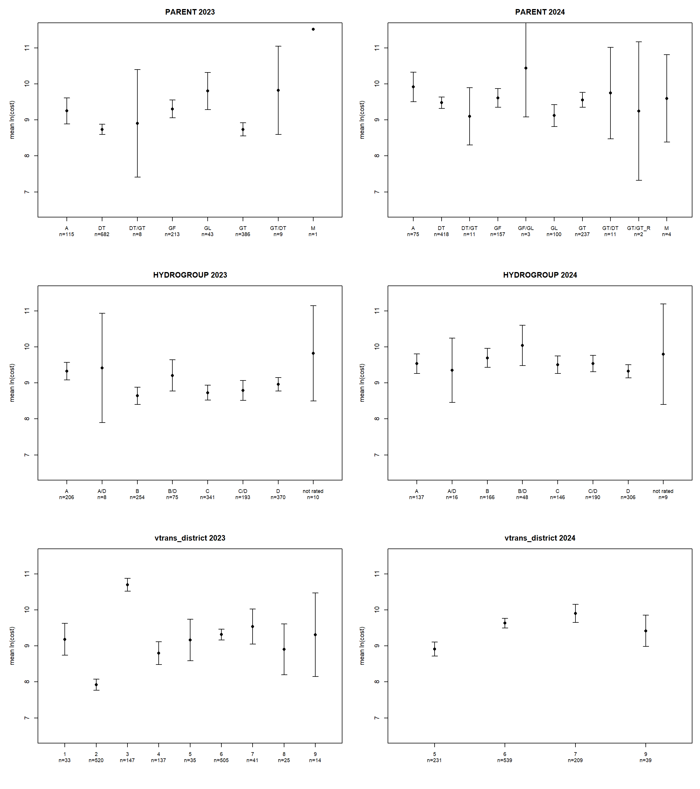

# Road Damage Category Screen

Graded segments, Precip >= 3.51 in, Averill excluded. Damage and cost = cost_dedup from analysis_{storm}_2026-09-27.csv, uncapped. Each script run once with STORM = 2023 and once with STORM = 2024.

## Script: crosstab.R

```r
# crosstab.R -- crosstab of each category against damage, following Quick-R "Frequencies and Crosstabs"
#   (https://www.datacamp.com/doc/r/frequencies): table, margin.table, prop.table, chisq.test, then
#   gmodels::CrossTable in its SPSS format.
# Set STORM to 2023 or 2024 and run from mrgp-roads-core:
#   "C:/Program Files/R/R-4.5.3/bin/Rscript.exe" twopart_simple_2026-09-17/R/crosstab.R
# Graded segments, Precip >= 3.51 in, Averill excluded; damage = cost_dedup > 0.

STORM <- 2023

library(gmodels)

d <- read.csv(paste0("twopart_simple_2026-09-17/data/analysis_", STORM, "_2026-09-27.csv"))
d <- d[d$Precip >= 3.51 & d$Town != "Averill", ]
d$damaged <- as.integer(d$cost_dedup > 0)

cat("CROSSTABS", STORM, "\n")

mytable <- table(d$PARENT, d$damaged)
print(mytable)
print(margin.table(mytable, 1))
print(margin.table(mytable, 2))
print(round(prop.table(mytable, 1), 4))
print(chisq.test(mytable))
CrossTable(d$PARENT, d$damaged, expected = TRUE, prop.r = TRUE, prop.c = FALSE, prop.t = FALSE,
           prop.chisq = FALSE, chisq = TRUE, asresid = TRUE, format = "SPSS")

mytable <- table(d$HYDROGROUP, d$damaged)
print(mytable)
print(margin.table(mytable, 1))
print(margin.table(mytable, 2))
print(round(prop.table(mytable, 1), 4))
print(chisq.test(mytable))
CrossTable(d$HYDROGROUP, d$damaged, expected = TRUE, prop.r = TRUE, prop.c = FALSE, prop.t = FALSE,
           prop.chisq = FALSE, chisq = TRUE, asresid = TRUE, format = "SPSS")

mytable <- table(d$vtrans_district, d$damaged)
print(mytable)
print(margin.table(mytable, 1))
print(margin.table(mytable, 2))
print(round(prop.table(mytable, 1), 4))
print(chisq.test(mytable))
CrossTable(d$vtrans_district, d$damaged, expected = TRUE, prop.r = TRUE, prop.c = FALSE, prop.t = FALSE,
           prop.chisq = FALSE, chisq = TRUE, asresid = TRUE, format = "SPSS")
```

## Crosstabs 2023

```
CROSSTABS 2023 
       
            0     1
  A      2389   115
  DT    23838   682
  DT/GT   169     8
  GF     9947   213
  GL     2456    43
  GT    17767   386
  GT/DT  1509     9
  M       163     1

    A    DT DT/GT    GF    GL    GT GT/DT     M 
 2504 24520   177 10160  2499 18153  1518   164 

    0     1 
58238  1457 
       
             0      1
  A     0.9541 0.0459
  DT    0.9722 0.0278
  DT/GT 0.9548 0.0452
  GF    0.9790 0.0210
  GL    0.9828 0.0172
  GT    0.9787 0.0213
  GT/DT 0.9941 0.0059
  M     0.9939 0.0061

	Pearson's Chi-squared test

data:  mytable
X-squared = 105.97, df = 7, p-value < 2.2e-16

   Cell Contents
|-------------------------|
|                   Count |
|         Expected Values |
|             Row Percent |
|           Adj Std Resid |
|-------------------------|

Total Observations in Table:  59695 

             | d$damaged 
    d$PARENT |        0  |        1  | Row Total | 
-------------|-----------|-----------|-----------|
           A |     2389  |      115  |     2504  | 
             | 2442.884  |   61.116  |           | 
             |   95.407% |    4.593% |    4.195% | 
             |   -7.129  |    7.129  |           | 
-------------|-----------|-----------|-----------|
          DT |    23838  |      682  |    24520  | 
             | 23921.530  |  598.470  |           | 
             |   97.219% |    2.781% |   41.075% | 
             |   -4.503  |    4.503  |           | 
-------------|-----------|-----------|-----------|
       DT/GT |      169  |        8  |      177  | 
             |  172.680  |    4.320  |           | 
             |   95.480% |    4.520% |    0.297% | 
             |   -1.795  |    1.795  |           | 
-------------|-----------|-----------|-----------|
          GF |     9947  |      213  |    10160  | 
             | 9912.021  |  247.979  |           | 
             |   97.904% |    2.096% |   17.020% | 
             |    2.469  |   -2.469  |           | 
-------------|-----------|-----------|-----------|
          GL |     2456  |       43  |     2499  | 
             | 2438.006  |   60.994  |           | 
             |   98.279% |    1.721% |    4.186% | 
             |    2.383  |   -2.383  |           | 
-------------|-----------|-----------|-----------|
          GT |    17767  |      386  |    18153  | 
             | 17709.932  |  443.068  |           | 
             |   97.874% |    2.126% |   30.410% | 
             |    3.290  |   -3.290  |           | 
-------------|-----------|-----------|-----------|
       GT/DT |     1509  |        9  |     1518  | 
             | 1480.950  |   37.050  |           | 
             |   99.407% |    0.593% |    2.543% | 
             |    4.726  |   -4.726  |           | 
-------------|-----------|-----------|-----------|
           M |      163  |        1  |      164  | 
             |  159.997  |    4.003  |           | 
             |   99.390% |    0.610% |    0.275% | 
             |    1.522  |   -1.522  |           | 
-------------|-----------|-----------|-----------|
Column Total |    58238  |     1457  |    59695  | 
-------------|-----------|-----------|-----------|

 
Statistics for All Table Factors

Pearson's Chi-squared test 
------------------------------------------------------------
Chi^2 =  105.9693     d.f. =  7     p =  6.287026e-20 

 
       Minimum expected frequency: 4.002814 
Cells with Expected Frequency < 5: 2 of 16 (12.5%)

           
                0     1
  A          9350   206
  A/D         745     8
  B          8310   254
  B/D        1976    75
  C         14074   341
  C/D        9331   193
  D         14173   370
  not rated   279    10

        A       A/D         B       B/D         C       C/D         D not rated 
     9556       753      8564      2051     14415      9524     14543       289 

    0     1 
58238  1457 
           
                 0      1
  A         0.9784 0.0216
  A/D       0.9894 0.0106
  B         0.9703 0.0297
  B/D       0.9634 0.0366
  C         0.9763 0.0237
  C/D       0.9797 0.0203
  D         0.9746 0.0254
  not rated 0.9654 0.0346

	Pearson's Chi-squared test

data:  mytable
X-squared = 41.045, df = 7, p-value = 7.936e-07

   Cell Contents
|-------------------------|
|                   Count |
|         Expected Values |
|             Row Percent |
|           Adj Std Resid |
|-------------------------|

Total Observations in Table:  59695 

             | d$damaged 
d$HYDROGROUP |        0  |        1  | Row Total | 
-------------|-----------|-----------|-----------|
           A |     9350  |      206  |     9556  | 
             | 9322.763  |  233.237  |           | 
             |   97.844% |    2.156% |   16.008% | 
             |    1.970  |   -1.970  |           | 
-------------|-----------|-----------|-----------|
         A/D |      745  |        8  |      753  | 
             |  734.621  |   18.379  |           | 
             |   98.938% |    1.062% |    1.261% | 
             |    2.467  |   -2.467  |           | 
-------------|-----------|-----------|-----------|
           B |     8310  |      254  |     8564  | 
             | 8354.975  |  209.025  |           | 
             |   97.034% |    2.966% |   14.346% | 
             |   -3.403  |    3.403  |           | 
-------------|-----------|-----------|-----------|
         B/D |     1976  |       75  |     2051  | 
             | 2000.940  |   50.060  |           | 
             |   96.343% |    3.657% |    3.436% | 
             |   -3.632  |    3.632  |           | 
-------------|-----------|-----------|-----------|
           C |    14074  |      341  |    14415  | 
             | 14063.167  |  351.833  |           | 
             |   97.634% |    2.366% |   24.148% | 
             |    0.671  |   -0.671  |           | 
-------------|-----------|-----------|-----------|
         C/D |     9331  |      193  |     9524  | 
             | 9291.544  |  232.456  |           | 
             |   97.974% |    2.026% |   15.954% | 
             |    2.858  |   -2.858  |           | 
-------------|-----------|-----------|-----------|
           D |    14173  |      370  |    14543  | 
             | 14188.043  |  354.957  |           | 
             |   97.456% |    2.544% |   24.362% | 
             |   -0.929  |    0.929  |           | 
-------------|-----------|-----------|-----------|
   not rated |      279  |       10  |      289  | 
             |  281.946  |    7.054  |           | 
             |   96.540% |    3.460% |    0.484% | 
             |   -1.126  |    1.126  |           | 
-------------|-----------|-----------|-----------|
Column Total |    58238  |     1457  |    59695  | 
-------------|-----------|-----------|-----------|

 
Statistics for All Table Factors

Pearson's Chi-squared test 
------------------------------------------------------------
Chi^2 =  41.04512     d.f. =  7     p =  7.936052e-07 

 
       Minimum expected frequency: 7.05374 

   
        0     1
  1  6046    33
  2  6069   520
  3 10360   147
  4 10425   137
  5  2645    35
  6  9650   505
  7  3617    41
  8  4196    25
  9  5230    14

    1     2     3     4     5     6     7     8     9 
 6079  6589 10507 10562  2680 10155  3658  4221  5244 

    0     1 
58238  1457 
   
         0      1
  1 0.9946 0.0054
  2 0.9211 0.0789
  3 0.9860 0.0140
  4 0.9870 0.0130
  5 0.9869 0.0131
  6 0.9503 0.0497
  7 0.9888 0.0112
  8 0.9941 0.0059
  9 0.9973 0.0027

	Pearson's Chi-squared test

data:  mytable
X-squared = 1499.5, df = 8, p-value < 2.2e-16

   Cell Contents
|-------------------------|
|                   Count |
|         Expected Values |
|             Row Percent |
|           Adj Std Resid |
|-------------------------|

Total Observations in Table:  59695 

                  | d$damaged 
d$vtrans_district |        0  |        1  | Row Total | 
------------------|-----------|-----------|-----------|
                1 |     6046  |       33  |     6079  | 
                  | 5930.627  |  148.373  |           | 
                  |   99.457% |    0.543% |   10.183% | 
                  |   10.118  |  -10.118  |           | 
------------------|-----------|-----------|-----------|
                2 |     6069  |      520  |     6589  | 
                  | 6428.180  |  160.820  |           | 
                  |   92.108% |    7.892% |   11.038% | 
                  |  -30.402  |   30.402  |           | 
------------------|-----------|-----------|-----------|
                3 |    10360  |      147  |    10507  | 
                  | 10250.551  |  256.449  |           | 
                  |   98.601% |    1.399% |   17.601% | 
                  |    7.623  |   -7.623  |           | 
------------------|-----------|-----------|-----------|
                4 |    10425  |      137  |    10562  | 
                  | 10304.209  |  257.791  |           | 
                  |   98.703% |    1.297% |   17.693% | 
                  |    8.396  |   -8.396  |           | 
------------------|-----------|-----------|-----------|
                5 |     2645  |       35  |     2680  | 
                  | 2614.588  |   65.412  |           | 
                  |   98.694% |    1.306% |    4.489% | 
                  |    3.895  |   -3.895  |           | 
------------------|-----------|-----------|-----------|
                6 |     9650  |      505  |    10155  | 
                  | 9907.143  |  247.857  |           | 
                  |   95.027% |    4.973% |   17.011% | 
                  |  -18.152  |   18.152  |           | 
------------------|-----------|-----------|-----------|
                7 |     3617  |       41  |     3658  | 
                  | 3568.718  |   89.282  |           | 
                  |   98.879% |    1.121% |    6.128% | 
                  |    5.340  |   -5.340  |           | 
------------------|-----------|-----------|-----------|
                8 |     4196  |       25  |     4221  | 
                  | 4117.976  |  103.024  |           | 
                  |   99.408% |    0.592% |    7.071% | 
                  |    8.073  |   -8.073  |           | 
------------------|-----------|-----------|-----------|
                9 |     5230  |       14  |     5244  | 
                  | 5116.008  |  127.992  |           | 
                  |   99.733% |    0.267% |    8.785% | 
                  |   10.681  |  -10.681  |           | 
------------------|-----------|-----------|-----------|
     Column Total |    58238  |     1457  |    59695  | 
------------------|-----------|-----------|-----------|

 
Statistics for All Table Factors

Pearson's Chi-squared test 
------------------------------------------------------------
Chi^2 =  1499.458     d.f. =  8     p =  1.758147e-318 

 
       Minimum expected frequency: 65.41184 

```

## Crosstabs 2024

```
CROSSTABS 2024 
         
             0    1
  A        930   75
  DT      8117  418
  DT/GT    123   11
  GF      2754  157
  GF/GL    101    3
  GL      3273  100
  GT      5437  237
  GT/DT    704   11
  GT/GT_R   89    2
  M         25    4

      A      DT   DT/GT      GF   GF/GL      GL      GT   GT/DT GT/GT_R       M 
   1005    8535     134    2911     104    3373    5674     715      91      29 

    0     1 
21553  1018 
         
               0      1
  A       0.9254 0.0746
  DT      0.9510 0.0490
  DT/GT   0.9179 0.0821
  GF      0.9461 0.0539
  GF/GL   0.9712 0.0288
  GL      0.9704 0.0296
  GT      0.9582 0.0418
  GT/DT   0.9846 0.0154
  GT/GT_R 0.9780 0.0220
  M       0.8621 0.1379

	Pearson's Chi-squared test

data:  mytable
X-squared = 75.244, df = 9, p-value = 1.415e-12

   Cell Contents
|-------------------------|
|                   Count |
|         Expected Values |
|             Row Percent |
|           Adj Std Resid |
|-------------------------|

Total Observations in Table:  22571 

             | d$damaged 
    d$PARENT |        0  |        1  | Row Total | 
-------------|-----------|-----------|-----------|
           A |      930  |       75  |     1005  | 
             |  959.672  |   45.328  |           | 
             |   92.537% |    7.463% |    4.453% | 
             |   -4.614  |    4.614  |           | 
-------------|-----------|-----------|-----------|
          DT |     8117  |      418  |     8535  | 
             | 8150.053  |  384.947  |           | 
             |   95.103% |    4.897% |   37.814% | 
             |   -2.186  |    2.186  |           | 
-------------|-----------|-----------|-----------|
       DT/GT |      123  |       11  |      134  | 
             |  127.956  |    6.044  |           | 
             |   91.791% |    8.209% |    0.594% | 
             |   -2.069  |    2.069  |           | 
-------------|-----------|-----------|-----------|
          GF |     2754  |      157  |     2911  | 
             | 2779.708  |  131.292  |           | 
             |   94.607% |    5.393% |   12.897% | 
             |   -2.460  |    2.460  |           | 
-------------|-----------|-----------|-----------|
       GF/GL |      101  |        3  |      104  | 
             |   99.309  |    4.691  |           | 
             |   97.115% |    2.885% |    0.461% | 
             |    0.801  |   -0.801  |           | 
-------------|-----------|-----------|-----------|
          GL |     3273  |      100  |     3373  | 
             | 3220.871  |  152.129  |           | 
             |   97.035% |    2.965% |   14.944% | 
             |    4.690  |   -4.690  |           | 
-------------|-----------|-----------|-----------|
          GT |     5437  |      237  |     5674  | 
             | 5418.091  |  255.909  |           | 
             |   95.823% |    4.177% |   25.138% | 
             |    1.398  |   -1.398  |           | 
-------------|-----------|-----------|-----------|
       GT/DT |      704  |       11  |      715  | 
             |  682.752  |   32.248  |           | 
             |   98.462% |    1.538% |    3.168% | 
             |    3.891  |   -3.891  |           | 
-------------|-----------|-----------|-----------|
     GT/GT_R |       89  |        2  |       91  | 
             |   86.896  |    4.104  |           | 
             |   97.802% |    2.198% |    0.403% | 
             |    1.065  |   -1.065  |           | 
-------------|-----------|-----------|-----------|
           M |       25  |        4  |       29  | 
             |   27.692  |    1.308  |           | 
             |   86.207% |   13.793% |    0.128% | 
             |   -2.410  |    2.410  |           | 
-------------|-----------|-----------|-----------|
Column Total |    21553  |     1018  |    22571  | 
-------------|-----------|-----------|-----------|

 
Statistics for All Table Factors

Pearson's Chi-squared test 
------------------------------------------------------------
Chi^2 =  75.24351     d.f. =  9     p =  1.414658e-12 

 
       Minimum expected frequency: 1.307962 
Cells with Expected Frequency < 5: 3 of 20 (15%)

           
               0    1
  A         2267  137
  A/D        346   16
  B         2877  166
  B/D        776   48
  C         3901  146
  C/D       3330  190
  D         7850  306
  not rated  206    9

        A       A/D         B       B/D         C       C/D         D not rated 
     2404       362      3043       824      4047      3520      8156       215 

    0     1 
21553  1018 
           
                 0      1
  A         0.9430 0.0570
  A/D       0.9558 0.0442
  B         0.9454 0.0546
  B/D       0.9417 0.0583
  C         0.9639 0.0361
  C/D       0.9460 0.0540
  D         0.9625 0.0375
  not rated 0.9581 0.0419

	Pearson's Chi-squared test

data:  mytable
X-squared = 42.548, df = 7, p-value = 4.078e-07

   Cell Contents
|-------------------------|
|                   Count |
|         Expected Values |
|             Row Percent |
|           Adj Std Resid |
|-------------------------|

Total Observations in Table:  22571 

             | d$damaged 
d$HYDROGROUP |        0  |        1  | Row Total | 
-------------|-----------|-----------|-----------|
           A |     2267  |      137  |     2404  | 
             | 2295.574  |  108.426  |           | 
             |   94.301% |    5.699% |   10.651% | 
             |   -2.971  |    2.971  |           | 
-------------|-----------|-----------|-----------|
         A/D |      346  |       16  |      362  | 
             |  345.673  |   16.327  |           | 
             |   95.580% |    4.420% |    1.604% | 
             |    0.083  |   -0.083  |           | 
-------------|-----------|-----------|-----------|
           B |     2877  |      166  |     3043  | 
             | 2905.754  |  137.246  |           | 
             |   94.545% |    5.455% |   13.482% | 
             |   -2.700  |    2.700  |           | 
-------------|-----------|-----------|-----------|
         B/D |      776  |       48  |      824  | 
             |  786.836  |   37.164  |           | 
             |   94.175% |    5.825% |    3.651% | 
             |   -1.853  |    1.853  |           | 
-------------|-----------|-----------|-----------|
           C |     3901  |      146  |     4047  | 
             | 3864.472  |  182.528  |           | 
             |   96.392% |    3.608% |   17.930% | 
             |    3.054  |   -3.054  |           | 
-------------|-----------|-----------|-----------|
         C/D |     3330  |      190  |     3520  | 
             | 3361.241  |  158.759  |           | 
             |   94.602% |    5.398% |   15.595% | 
             |   -2.762  |    2.762  |           | 
-------------|-----------|-----------|-----------|
           D |     7850  |      306  |     8156  | 
             | 7788.147  |  367.853  |           | 
             |   96.248% |    3.752% |   36.135% | 
             |    4.130  |   -4.130  |           | 
-------------|-----------|-----------|-----------|
   not rated |      206  |        9  |      215  | 
             |  205.303  |    9.697  |           | 
             |   95.814% |    4.186% |    0.953% | 
             |    0.230  |   -0.230  |           | 
-------------|-----------|-----------|-----------|
Column Total |    21553  |     1018  |    22571  | 
-------------|-----------|-----------|-----------|

 
Statistics for All Table Factors

Pearson's Chi-squared test 
------------------------------------------------------------
Chi^2 =  42.5478     d.f. =  7     p =  4.077925e-07 

 
       Minimum expected frequency: 9.696956 

   
       0    1
  3  137    0
  5 5267  231
  6 5924  539
  7 7034  209
  8  174    0
  9 3017   39

   3    5    6    7    8    9 
 137 5498 6463 7243  174 3056 

    0     1 
21553  1018 
   
         0      1
  3 1.0000 0.0000
  5 0.9580 0.0420
  6 0.9166 0.0834
  7 0.9711 0.0289
  8 1.0000 0.0000
  9 0.9872 0.0128

	Pearson's Chi-squared test

data:  mytable
X-squared = 354.59, df = 5, p-value < 2.2e-16

   Cell Contents
|-------------------------|
|                   Count |
|         Expected Values |
|             Row Percent |
|           Adj Std Resid |
|-------------------------|

Total Observations in Table:  22571 

                  | d$damaged 
d$vtrans_district |        0  |        1  | Row Total | 
------------------|-----------|-----------|-----------|
                3 |      137  |        0  |      137  | 
                  |  130.821  |    6.179  |           | 
                  |  100.000% |    0.000% |    0.607% | 
                  |    2.552  |   -2.552  |           | 
------------------|-----------|-----------|-----------|
                5 |     5267  |      231  |     5498  | 
                  | 5250.029  |  247.971  |           | 
                  |   95.798% |    4.202% |   24.359% | 
                  |    1.268  |   -1.268  |           | 
------------------|-----------|-----------|-----------|
                6 |     5924  |      539  |     6463  | 
                  | 6171.505  |  291.495  |           | 
                  |   91.660% |    8.340% |   28.634% | 
                  |  -17.561  |   17.561  |           | 
------------------|-----------|-----------|-----------|
                7 |     7034  |      209  |     7243  | 
                  | 6916.325  |  326.675  |           | 
                  |   97.114% |    2.886% |   32.090% | 
                  |    8.085  |   -8.085  |           | 
------------------|-----------|-----------|-----------|
                8 |      174  |        0  |      174  | 
                  |  166.152  |    7.848  |           | 
                  |  100.000% |    0.000% |    0.771% | 
                  |    2.878  |   -2.878  |           | 
------------------|-----------|-----------|-----------|
                9 |     3017  |       39  |     3056  | 
                  | 2918.168  |  137.832  |           | 
                  |   98.724% |    1.276% |   13.539% | 
                  |    9.265  |   -9.265  |           | 
------------------|-----------|-----------|-----------|
     Column Total |    21553  |     1018  |    22571  | 
------------------|-----------|-----------|-----------|

 
Statistics for All Table Factors

Pearson's Chi-squared test 
------------------------------------------------------------
Chi^2 =  354.5907     d.f. =  5     p =  1.79761e-74 

 
       Minimum expected frequency: 6.178991 

```

## Script: anova_spss_tables.R

```r
# anova_spss_tables.R -- one-way ANOVA of ln(cost) by category, printed as the two SPSS tables: ANOVA
#   (Between Groups / Within Groups / Total) and Multiple Comparisons (Bonferroni, every ordered pair).
# Set STORM to 2023 or 2024 and run from mrgp-roads-core:
#   "C:/Program Files/R/R-4.5.3/bin/Rscript.exe" twopart_simple_2026-09-17/R/anova_spss_tables.R
# Damaged graded segments, Precip >= 3.51 in, Averill excluded; cost = cost_dedup, uncapped. Output is markdown.

STORM <- 2023

d <- read.csv(paste0("twopart_simple_2026-09-17/data/analysis_", STORM, "_2026-09-27.csv"))
k <- d[d$Precip >= 3.51 & d$Town != "Averill" & d$cost_dedup > 0, ]
k$ln_cost <- log(k$cost_dedup)

for (v in c("PARENT", "HYDROGROUP", "vtrans_district")) {
  g <- factor(k[[v]])
  a <- summary(aov(k$ln_cost ~ g))[[1]]          # the ANOVA table R computes

  cat("\n**ANOVA** -- ln(cost) by ", v, ", ", STORM, " storm\n\n", sep = "")
  cat("| | Sum of Squares | df | Mean Square | F | Sig. |\n|---|---:|---:|---:|---:|---:|\n")
  cat("| Between Groups | ", sprintf("%.3f", a$`Sum Sq`[1]), " | ", a$Df[1], " | ", sprintf("%.3f", a$`Mean Sq`[1]),
      " | ", sprintf("%.3f", a$`F value`[1]), " | ", sub("^0", "", sprintf("%.3f", a$`Pr(>F)`[1])), " |\n", sep = "")
  cat("| Within Groups | ", sprintf("%.3f", a$`Sum Sq`[2]), " | ", a$Df[2], " | ", sprintf("%.3f", a$`Mean Sq`[2]), " | | |\n", sep = "")
  cat("| Total | ", sprintf("%.3f", sum(a$`Sum Sq`)), " | ", sum(a$Df), " | | | |\n", sep = "")

  # Bonferroni: p multiplied by the number of pairs; the interval uses the matching critical t
  n_g    <- as.numeric(table(g))
  mean_g <- as.numeric(tapply(k$ln_cost, g, mean))
  mse    <- a$`Mean Sq`[2]
  df_w   <- a$Df[2]
  pairs  <- nlevels(g) * (nlevels(g) - 1) / 2
  t_crit <- qt(1 - 0.05 / (2 * pairs), df_w)

  cat("\n**Multiple Comparisons** -- Dependent Variable: ln(cost); Bonferroni\n\n")
  cat("| (I) ", v, " | (J) ", v, " | Mean Difference (I-J) | Std. Error | Sig. | 95% CI Lower Bound | 95% CI Upper Bound |\n", sep = "")
  cat("|---|---|---:|---:|---:|---:|---:|\n")
  for (i in 1:nlevels(g)) for (j in 1:nlevels(g)) {
    if (i == j) next
    diff <- mean_g[i] - mean_g[j]
    se   <- sqrt(mse * (1 / n_g[i] + 1 / n_g[j]))
    p    <- min(1, 2 * pt(-abs(diff / se), df_w) * pairs)
    cat("| ", if (j == 1 || (i == 1 && j == 2)) levels(g)[i] else "", " | ", levels(g)[j], " | ",
        sprintf("%.3f", diff), if (p < 0.05) "\\*" else "", " | ", sprintf("%.3f", se), " | ",
        sub("^0", "", sprintf("%.3f", p)), " | ", sprintf("%.2f", diff - t_crit * se), " | ", sprintf("%.2f", diff + t_crit * se), " |\n", sep = "")
  }
  cat("\n\\*. The mean difference is significant at the 0.05 level.\n")
}
```

## ANOVA 2023

**ANOVA** -- ln(cost) by PARENT, 2023 storm

| | Sum of Squares | df | Mean Square | F | Sig. |
|---|---:|---:|---:|---:|---:|
| Between Groups | 127.123 | 7 | 18.160 | 5.287 | .000 |
| Within Groups | 4977.000 | 1449 | 3.435 | | |
| Total | 5104.123 | 1456 | | | |

**Multiple Comparisons** -- Dependent Variable: ln(cost); Bonferroni

| (I) PARENT | (J) PARENT | Mean Difference (I-J) | Std. Error | Sig. | 95% CI Lower Bound | 95% CI Upper Bound |
|---|---|---:|---:|---:|---:|---:|
| A | DT | 0.513 | 0.187 | .170 | -0.07 | 1.10 |
|  | DT/GT | 0.346 | 0.678 | 1.000 | -1.77 | 2.47 |
|  | GF | -0.054 | 0.214 | 1.000 | -0.73 | 0.62 |
|  | GL | -0.552 | 0.331 | 1.000 | -1.59 | 0.48 |
|  | GT | 0.515 | 0.197 | .252 | -0.10 | 1.13 |
|  | GT/DT | -0.570 | 0.641 | 1.000 | -2.58 | 1.44 |
|  | M | -2.270 | 1.861 | 1.000 | -8.09 | 3.56 |
| DT | A | -0.513 | 0.187 | .170 | -1.10 | 0.07 |
|  | DT/GT | -0.168 | 0.659 | 1.000 | -2.23 | 1.89 |
|  | GF | -0.568\* | 0.145 | .003 | -1.02 | -0.11 |
|  | GL | -1.066\* | 0.291 | .007 | -1.98 | -0.15 |
|  | GT | 0.002 | 0.118 | 1.000 | -0.37 | 0.37 |
|  | GT/DT | -1.084 | 0.622 | 1.000 | -3.03 | 0.86 |
|  | M | -2.783 | 1.855 | 1.000 | -8.59 | 3.02 |
| DT/GT | A | -0.346 | 0.678 | 1.000 | -2.47 | 1.77 |
|  | DT | 0.168 | 0.659 | 1.000 | -1.89 | 2.23 |
|  | GF | -0.400 | 0.667 | 1.000 | -2.49 | 1.69 |
|  | GL | -0.898 | 0.714 | 1.000 | -3.13 | 1.34 |
|  | GT | 0.169 | 0.662 | 1.000 | -1.90 | 2.24 |
|  | GT/DT | -0.916 | 0.901 | 1.000 | -3.73 | 1.90 |
|  | M | -2.615 | 1.966 | 1.000 | -8.77 | 3.54 |
| GF | A | 0.054 | 0.214 | 1.000 | -0.62 | 0.73 |
|  | DT | 0.568\* | 0.145 | .003 | 0.11 | 1.02 |
|  | DT/GT | 0.400 | 0.667 | 1.000 | -1.69 | 2.49 |
|  | GL | -0.498 | 0.310 | 1.000 | -1.47 | 0.47 |
|  | GT | 0.569\* | 0.158 | .009 | 0.07 | 1.06 |
|  | GT/DT | -0.516 | 0.631 | 1.000 | -2.49 | 1.46 |
|  | M | -2.215 | 1.858 | 1.000 | -8.03 | 3.60 |
| GL | A | 0.552 | 0.331 | 1.000 | -0.48 | 1.59 |
|  | DT | 1.066\* | 0.291 | .007 | 0.15 | 1.98 |
|  | DT/GT | 0.898 | 0.714 | 1.000 | -1.34 | 3.13 |
|  | GF | 0.498 | 0.310 | 1.000 | -0.47 | 1.47 |
|  | GT | 1.067\* | 0.298 | .010 | 0.13 | 2.00 |
|  | GT/DT | -0.018 | 0.679 | 1.000 | -2.14 | 2.11 |
|  | M | -1.718 | 1.875 | 1.000 | -7.58 | 4.15 |
| GT | A | -0.515 | 0.197 | .252 | -1.13 | 0.10 |
|  | DT | -0.002 | 0.118 | 1.000 | -0.37 | 0.37 |
|  | DT/GT | -0.169 | 0.662 | 1.000 | -2.24 | 1.90 |
|  | GF | -0.569\* | 0.158 | .009 | -1.06 | -0.07 |
|  | GL | -1.067\* | 0.298 | .010 | -2.00 | -0.13 |
|  | GT/DT | -1.085 | 0.625 | 1.000 | -3.04 | 0.87 |
|  | M | -2.785 | 1.856 | 1.000 | -8.59 | 3.02 |
| GT/DT | A | 0.570 | 0.641 | 1.000 | -1.44 | 2.58 |
|  | DT | 1.084 | 0.622 | 1.000 | -0.86 | 3.03 |
|  | DT/GT | 0.916 | 0.901 | 1.000 | -1.90 | 3.73 |
|  | GF | 0.516 | 0.631 | 1.000 | -1.46 | 2.49 |
|  | GL | 0.018 | 0.679 | 1.000 | -2.11 | 2.14 |
|  | GT | 1.085 | 0.625 | 1.000 | -0.87 | 3.04 |
|  | M | -1.699 | 1.954 | 1.000 | -7.81 | 4.41 |
| M | A | 2.270 | 1.861 | 1.000 | -3.56 | 8.09 |
|  | DT | 2.783 | 1.855 | 1.000 | -3.02 | 8.59 |
|  | DT/GT | 2.615 | 1.966 | 1.000 | -3.54 | 8.77 |
|  | GF | 2.215 | 1.858 | 1.000 | -3.60 | 8.03 |
|  | GL | 1.718 | 1.875 | 1.000 | -4.15 | 7.58 |
|  | GT | 2.785 | 1.856 | 1.000 | -3.02 | 8.59 |
|  | GT/DT | 1.699 | 1.954 | 1.000 | -4.41 | 7.81 |

\*. The mean difference is significant at the 0.05 level.

**ANOVA** -- ln(cost) by HYDROGROUP, 2023 storm

| | Sum of Squares | df | Mean Square | F | Sig. |
|---|---:|---:|---:|---:|---:|
| Between Groups | 85.782 | 7 | 12.255 | 3.538 | .001 |
| Within Groups | 5018.341 | 1449 | 3.463 | | |
| Total | 5104.123 | 1456 | | | |

**Multiple Comparisons** -- Dependent Variable: ln(cost); Bonferroni

| (I) HYDROGROUP | (J) HYDROGROUP | Mean Difference (I-J) | Std. Error | Sig. | 95% CI Lower Bound | 95% CI Upper Bound |
|---|---|---:|---:|---:|---:|---:|
| A | A/D | -0.090 | 0.671 | 1.000 | -2.19 | 2.01 |
|  | B | 0.684\* | 0.174 | .003 | 0.14 | 1.23 |
|  | B/D | 0.119 | 0.251 | 1.000 | -0.67 | 0.90 |
|  | C | 0.596\* | 0.164 | .008 | 0.08 | 1.11 |
|  | C/D | 0.535 | 0.186 | .116 | -0.05 | 1.12 |
|  | D | 0.361 | 0.162 | .719 | -0.14 | 0.87 |
|  | not rated | -0.499 | 0.603 | 1.000 | -2.38 | 1.39 |
| A/D | A | 0.090 | 0.671 | 1.000 | -2.01 | 2.19 |
|  | B | 0.774 | 0.668 | 1.000 | -1.32 | 2.87 |
|  | B/D | 0.209 | 0.692 | 1.000 | -1.96 | 2.38 |
|  | C | 0.686 | 0.666 | 1.000 | -1.40 | 2.77 |
|  | C/D | 0.625 | 0.671 | 1.000 | -1.48 | 2.73 |
|  | D | 0.451 | 0.665 | 1.000 | -1.63 | 2.53 |
|  | not rated | -0.409 | 0.883 | 1.000 | -3.17 | 2.35 |
| B | A | -0.684\* | 0.174 | .003 | -1.23 | -0.14 |
|  | A/D | -0.774 | 0.668 | 1.000 | -2.87 | 1.32 |
|  | B/D | -0.565 | 0.245 | .590 | -1.33 | 0.20 |
|  | C | -0.088 | 0.154 | 1.000 | -0.57 | 0.39 |
|  | C/D | -0.149 | 0.178 | 1.000 | -0.71 | 0.41 |
|  | D | -0.323 | 0.152 | .936 | -0.80 | 0.15 |
|  | not rated | -1.183 | 0.600 | 1.000 | -3.06 | 0.69 |
| B/D | A | -0.119 | 0.251 | 1.000 | -0.90 | 0.67 |
|  | A/D | -0.209 | 0.692 | 1.000 | -2.38 | 1.96 |
|  | B | 0.565 | 0.245 | .590 | -0.20 | 1.33 |
|  | C | 0.477 | 0.237 | 1.000 | -0.27 | 1.22 |
|  | C/D | 0.416 | 0.253 | 1.000 | -0.38 | 1.21 |
|  | D | 0.242 | 0.236 | 1.000 | -0.50 | 0.98 |
|  | not rated | -0.618 | 0.627 | 1.000 | -2.58 | 1.34 |
| C | A | -0.596\* | 0.164 | .008 | -1.11 | -0.08 |
|  | A/D | -0.686 | 0.666 | 1.000 | -2.77 | 1.40 |
|  | B | 0.088 | 0.154 | 1.000 | -0.39 | 0.57 |
|  | B/D | -0.477 | 0.237 | 1.000 | -1.22 | 0.27 |
|  | C/D | -0.061 | 0.168 | 1.000 | -0.59 | 0.46 |
|  | D | -0.235 | 0.140 | 1.000 | -0.67 | 0.20 |
|  | not rated | -1.095 | 0.597 | 1.000 | -2.96 | 0.77 |
| C/D | A | -0.535 | 0.186 | .116 | -1.12 | 0.05 |
|  | A/D | -0.625 | 0.671 | 1.000 | -2.73 | 1.48 |
|  | B | 0.149 | 0.178 | 1.000 | -0.41 | 0.71 |
|  | B/D | -0.416 | 0.253 | 1.000 | -1.21 | 0.38 |
|  | C | 0.061 | 0.168 | 1.000 | -0.46 | 0.59 |
|  | D | -0.174 | 0.165 | 1.000 | -0.69 | 0.34 |
|  | not rated | -1.034 | 0.604 | 1.000 | -2.92 | 0.85 |
| D | A | -0.361 | 0.162 | .719 | -0.87 | 0.14 |
|  | A/D | -0.451 | 0.665 | 1.000 | -2.53 | 1.63 |
|  | B | 0.323 | 0.152 | .936 | -0.15 | 0.80 |
|  | B/D | -0.242 | 0.236 | 1.000 | -0.98 | 0.50 |
|  | C | 0.235 | 0.140 | 1.000 | -0.20 | 0.67 |
|  | C/D | 0.174 | 0.165 | 1.000 | -0.34 | 0.69 |
|  | not rated | -0.860 | 0.596 | 1.000 | -2.73 | 1.01 |
| not rated | A | 0.499 | 0.603 | 1.000 | -1.39 | 2.38 |
|  | A/D | 0.409 | 0.883 | 1.000 | -2.35 | 3.17 |
|  | B | 1.183 | 0.600 | 1.000 | -0.69 | 3.06 |
|  | B/D | 0.618 | 0.627 | 1.000 | -1.34 | 2.58 |
|  | C | 1.095 | 0.597 | 1.000 | -0.77 | 2.96 |
|  | C/D | 1.034 | 0.604 | 1.000 | -0.85 | 2.92 |
|  | D | 0.860 | 0.596 | 1.000 | -1.01 | 2.73 |

\*. The mean difference is significant at the 0.05 level.

**ANOVA** -- ln(cost) by vtrans_district, 2023 storm

| | Sum of Squares | df | Mean Square | F | Sig. |
|---|---:|---:|---:|---:|---:|
| Between Groups | 1087.143 | 8 | 135.893 | 48.985 | .000 |
| Within Groups | 4016.980 | 1448 | 2.774 | | |
| Total | 5104.123 | 1456 | | | |

**Multiple Comparisons** -- Dependent Variable: ln(cost); Bonferroni

| (I) vtrans_district | (J) vtrans_district | Mean Difference (I-J) | Std. Error | Sig. | 95% CI Lower Bound | 95% CI Upper Bound |
|---|---|---:|---:|---:|---:|---:|
| 1 | 2 | 1.263\* | 0.299 | .001 | 0.30 | 2.22 |
|  | 3 | -1.516\* | 0.321 | .000 | -2.54 | -0.49 |
|  | 4 | 0.387 | 0.323 | 1.000 | -0.65 | 1.42 |
|  | 5 | 0.017 | 0.404 | 1.000 | -1.28 | 1.31 |
|  | 6 | -0.131 | 0.299 | 1.000 | -1.09 | 0.83 |
|  | 7 | -0.356 | 0.390 | 1.000 | -1.60 | 0.89 |
|  | 8 | 0.275 | 0.442 | 1.000 | -1.14 | 1.69 |
|  | 9 | -0.129 | 0.531 | 1.000 | -1.83 | 1.57 |
| 2 | 1 | -1.263\* | 0.299 | .001 | -2.22 | -0.30 |
|  | 3 | -2.779\* | 0.156 | .000 | -3.28 | -2.28 |
|  | 4 | -0.876\* | 0.160 | .000 | -1.39 | -0.36 |
|  | 5 | -1.246\* | 0.291 | .001 | -2.18 | -0.31 |
|  | 6 | -1.394\* | 0.104 | .000 | -1.73 | -1.06 |
|  | 7 | -1.618\* | 0.270 | .000 | -2.48 | -0.75 |
|  | 8 | -0.987 | 0.341 | .138 | -2.08 | 0.10 |
|  | 9 | -1.391 | 0.451 | .075 | -2.84 | 0.05 |
| 3 | 1 | 1.516\* | 0.321 | .000 | 0.49 | 2.54 |
|  | 2 | 2.779\* | 0.156 | .000 | 2.28 | 3.28 |
|  | 4 | 1.903\* | 0.198 | .000 | 1.27 | 2.54 |
|  | 5 | 1.533\* | 0.313 | .000 | 0.53 | 2.54 |
|  | 6 | 1.385\* | 0.156 | .000 | 0.88 | 1.88 |
|  | 7 | 1.160\* | 0.294 | .003 | 0.22 | 2.10 |
|  | 8 | 1.791\* | 0.360 | .000 | 0.64 | 2.95 |
|  | 9 | 1.387 | 0.466 | .106 | -0.10 | 2.88 |
| 4 | 1 | -0.387 | 0.323 | 1.000 | -1.42 | 0.65 |
|  | 2 | 0.876\* | 0.160 | .000 | 0.36 | 1.39 |
|  | 3 | -1.903\* | 0.198 | .000 | -2.54 | -1.27 |
|  | 5 | -0.370 | 0.315 | 1.000 | -1.38 | 0.64 |
|  | 6 | -0.518\* | 0.160 | .046 | -1.03 | -0.00 |
|  | 7 | -0.742 | 0.296 | .447 | -1.69 | 0.21 |
|  | 8 | -0.111 | 0.362 | 1.000 | -1.27 | 1.05 |
|  | 9 | -0.515 | 0.467 | 1.000 | -2.01 | 0.98 |
| 5 | 1 | -0.017 | 0.404 | 1.000 | -1.31 | 1.28 |
|  | 2 | 1.246\* | 0.291 | .001 | 0.31 | 2.18 |
|  | 3 | -1.533\* | 0.313 | .000 | -2.54 | -0.53 |
|  | 4 | 0.370 | 0.315 | 1.000 | -0.64 | 1.38 |
|  | 6 | -0.148 | 0.291 | 1.000 | -1.08 | 0.78 |
|  | 7 | -0.372 | 0.383 | 1.000 | -1.60 | 0.86 |
|  | 8 | 0.259 | 0.436 | 1.000 | -1.14 | 1.66 |
|  | 9 | -0.145 | 0.527 | 1.000 | -1.83 | 1.54 |
| 6 | 1 | 0.131 | 0.299 | 1.000 | -0.83 | 1.09 |
|  | 2 | 1.394\* | 0.104 | .000 | 1.06 | 1.73 |
|  | 3 | -1.385\* | 0.156 | .000 | -1.88 | -0.88 |
|  | 4 | 0.518\* | 0.160 | .046 | 0.00 | 1.03 |
|  | 5 | 0.148 | 0.291 | 1.000 | -0.78 | 1.08 |
|  | 7 | -0.225 | 0.270 | 1.000 | -1.09 | 0.64 |
|  | 8 | 0.406 | 0.341 | 1.000 | -0.69 | 1.50 |
|  | 9 | 0.003 | 0.451 | 1.000 | -1.44 | 1.45 |
| 7 | 1 | 0.356 | 0.390 | 1.000 | -0.89 | 1.60 |
|  | 2 | 1.618\* | 0.270 | .000 | 0.75 | 2.48 |
|  | 3 | -1.160\* | 0.294 | .003 | -2.10 | -0.22 |
|  | 4 | 0.742 | 0.296 | .447 | -0.21 | 1.69 |
|  | 5 | 0.372 | 0.383 | 1.000 | -0.86 | 1.60 |
|  | 6 | 0.225 | 0.270 | 1.000 | -0.64 | 1.09 |
|  | 8 | 0.631 | 0.423 | 1.000 | -0.72 | 1.98 |
|  | 9 | 0.227 | 0.516 | 1.000 | -1.42 | 1.88 |
| 8 | 1 | -0.275 | 0.442 | 1.000 | -1.69 | 1.14 |
|  | 2 | 0.987 | 0.341 | .138 | -0.10 | 2.08 |
|  | 3 | -1.791\* | 0.360 | .000 | -2.95 | -0.64 |
|  | 4 | 0.111 | 0.362 | 1.000 | -1.05 | 1.27 |
|  | 5 | -0.259 | 0.436 | 1.000 | -1.66 | 1.14 |
|  | 6 | -0.406 | 0.341 | 1.000 | -1.50 | 0.69 |
|  | 7 | -0.631 | 0.423 | 1.000 | -1.98 | 0.72 |
|  | 9 | -0.404 | 0.556 | 1.000 | -2.18 | 1.38 |
| 9 | 1 | 0.129 | 0.531 | 1.000 | -1.57 | 1.83 |
|  | 2 | 1.391 | 0.451 | .075 | -0.05 | 2.84 |
|  | 3 | -1.387 | 0.466 | .106 | -2.88 | 0.10 |
|  | 4 | 0.515 | 0.467 | 1.000 | -0.98 | 2.01 |
|  | 5 | 0.145 | 0.527 | 1.000 | -1.54 | 1.83 |
|  | 6 | -0.003 | 0.451 | 1.000 | -1.45 | 1.44 |
|  | 7 | -0.227 | 0.516 | 1.000 | -1.88 | 1.42 |
|  | 8 | 0.404 | 0.556 | 1.000 | -1.38 | 2.18 |

\*. The mean difference is significant at the 0.05 level.

## ANOVA 2024

**ANOVA** -- ln(cost) by PARENT, 2024 storm

| | Sum of Squares | df | Mean Square | F | Sig. |
|---|---:|---:|---:|---:|---:|
| Between Groups | 35.197 | 9 | 3.911 | 1.491 | .146 |
| Within Groups | 2644.051 | 1008 | 2.623 | | |
| Total | 2679.248 | 1017 | | | |

**Multiple Comparisons** -- Dependent Variable: ln(cost); Bonferroni

| (I) PARENT | (J) PARENT | Mean Difference (I-J) | Std. Error | Sig. | 95% CI Lower Bound | 95% CI Upper Bound |
|---|---|---:|---:|---:|---:|---:|
| A | DT | 0.437 | 0.203 | 1.000 | -0.23 | 1.10 |
|  | DT/GT | 0.819 | 0.523 | 1.000 | -0.89 | 2.53 |
|  | GF | 0.304 | 0.227 | 1.000 | -0.44 | 1.05 |
|  | GF/GL | -0.526 | 0.954 | 1.000 | -3.64 | 2.59 |
|  | GL | 0.794 | 0.247 | .062 | -0.02 | 1.60 |
|  | GT | 0.359 | 0.215 | 1.000 | -0.34 | 1.06 |
|  | GT/DT | 0.171 | 0.523 | 1.000 | -1.54 | 1.88 |
|  | GT/GT_R | 0.672 | 1.160 | 1.000 | -3.12 | 4.47 |
|  | M | 0.318 | 0.831 | 1.000 | -2.40 | 3.04 |
| DT | A | -0.437 | 0.203 | 1.000 | -1.10 | 0.23 |
|  | DT/GT | 0.382 | 0.495 | 1.000 | -1.24 | 2.00 |
|  | GF | -0.134 | 0.152 | 1.000 | -0.63 | 0.36 |
|  | GF/GL | -0.963 | 0.938 | 1.000 | -4.03 | 2.11 |
|  | GL | 0.357 | 0.180 | 1.000 | -0.23 | 0.95 |
|  | GT | -0.078 | 0.132 | 1.000 | -0.51 | 0.35 |
|  | GT/DT | -0.267 | 0.495 | 1.000 | -1.88 | 1.35 |
|  | GT/GT_R | 0.235 | 1.148 | 1.000 | -3.52 | 3.99 |
|  | M | -0.119 | 0.814 | 1.000 | -2.78 | 2.54 |
| DT/GT | A | -0.819 | 0.523 | 1.000 | -2.53 | 0.89 |
|  | DT | -0.382 | 0.495 | 1.000 | -2.00 | 1.24 |
|  | GF | -0.515 | 0.505 | 1.000 | -2.17 | 1.14 |
|  | GF/GL | -1.344 | 1.055 | 1.000 | -4.79 | 2.11 |
|  | GL | -0.025 | 0.514 | 1.000 | -1.71 | 1.66 |
|  | GT | -0.460 | 0.500 | 1.000 | -2.09 | 1.17 |
|  | GT/DT | -0.648 | 0.691 | 1.000 | -2.91 | 1.61 |
|  | GT/GT_R | -0.147 | 1.245 | 1.000 | -4.22 | 3.92 |
|  | M | -0.501 | 0.946 | 1.000 | -3.59 | 2.59 |
| GF | A | -0.304 | 0.227 | 1.000 | -1.05 | 0.44 |
|  | DT | 0.134 | 0.152 | 1.000 | -0.36 | 0.63 |
|  | DT/GT | 0.515 | 0.505 | 1.000 | -1.14 | 2.17 |
|  | GF/GL | -0.829 | 0.944 | 1.000 | -3.92 | 2.26 |
|  | GL | 0.490 | 0.207 | .817 | -0.19 | 1.17 |
|  | GT | 0.056 | 0.167 | 1.000 | -0.49 | 0.60 |
|  | GT/DT | -0.133 | 0.505 | 1.000 | -1.78 | 1.52 |
|  | GT/GT_R | 0.368 | 1.152 | 1.000 | -3.40 | 4.14 |
|  | M | 0.014 | 0.820 | 1.000 | -2.67 | 2.70 |
| GF/GL | A | 0.526 | 0.954 | 1.000 | -2.59 | 3.64 |
|  | DT | 0.963 | 0.938 | 1.000 | -2.11 | 4.03 |
|  | DT/GT | 1.344 | 1.055 | 1.000 | -2.11 | 4.79 |
|  | GF | 0.829 | 0.944 | 1.000 | -2.26 | 3.92 |
|  | GL | 1.320 | 0.949 | 1.000 | -1.78 | 4.42 |
|  | GT | 0.885 | 0.941 | 1.000 | -2.19 | 3.96 |
|  | GT/DT | 0.696 | 1.055 | 1.000 | -2.75 | 4.15 |
|  | GT/GT_R | 1.198 | 1.478 | 1.000 | -3.64 | 6.03 |
|  | M | 0.844 | 1.237 | 1.000 | -3.20 | 4.89 |
| GL | A | -0.794 | 0.247 | .062 | -1.60 | 0.02 |
|  | DT | -0.357 | 0.180 | 1.000 | -0.95 | 0.23 |
|  | DT/GT | 0.025 | 0.514 | 1.000 | -1.66 | 1.71 |
|  | GF | -0.490 | 0.207 | .817 | -1.17 | 0.19 |
|  | GF/GL | -1.320 | 0.949 | 1.000 | -4.42 | 1.78 |
|  | GT | -0.435 | 0.193 | 1.000 | -1.07 | 0.20 |
|  | GT/DT | -0.623 | 0.514 | 1.000 | -2.31 | 1.06 |
|  | GT/GT_R | -0.122 | 1.157 | 1.000 | -3.90 | 3.66 |
|  | M | -0.476 | 0.826 | 1.000 | -3.18 | 2.22 |
| GT | A | -0.359 | 0.215 | 1.000 | -1.06 | 0.34 |
|  | DT | 0.078 | 0.132 | 1.000 | -0.35 | 0.51 |
|  | DT/GT | 0.460 | 0.500 | 1.000 | -1.17 | 2.09 |
|  | GF | -0.056 | 0.167 | 1.000 | -0.60 | 0.49 |
|  | GF/GL | -0.885 | 0.941 | 1.000 | -3.96 | 2.19 |
|  | GL | 0.435 | 0.193 | 1.000 | -0.20 | 1.07 |
|  | GT/DT | -0.189 | 0.500 | 1.000 | -1.82 | 1.45 |
|  | GT/GT_R | 0.313 | 1.150 | 1.000 | -3.45 | 4.07 |
|  | M | -0.041 | 0.817 | 1.000 | -2.71 | 2.63 |
| GT/DT | A | -0.171 | 0.523 | 1.000 | -1.88 | 1.54 |
|  | DT | 0.267 | 0.495 | 1.000 | -1.35 | 1.88 |
|  | DT/GT | 0.648 | 0.691 | 1.000 | -1.61 | 2.91 |
|  | GF | 0.133 | 0.505 | 1.000 | -1.52 | 1.78 |
|  | GF/GL | -0.696 | 1.055 | 1.000 | -4.15 | 2.75 |
|  | GL | 0.623 | 0.514 | 1.000 | -1.06 | 2.31 |
|  | GT | 0.189 | 0.500 | 1.000 | -1.45 | 1.82 |
|  | GT/GT_R | 0.501 | 1.245 | 1.000 | -3.57 | 4.57 |
|  | M | 0.147 | 0.946 | 1.000 | -2.95 | 3.24 |
| GT/GT_R | A | -0.672 | 1.160 | 1.000 | -4.47 | 3.12 |
|  | DT | -0.235 | 1.148 | 1.000 | -3.99 | 3.52 |
|  | DT/GT | 0.147 | 1.245 | 1.000 | -3.92 | 4.22 |
|  | GF | -0.368 | 1.152 | 1.000 | -4.14 | 3.40 |
|  | GF/GL | -1.198 | 1.478 | 1.000 | -6.03 | 3.64 |
|  | GL | 0.122 | 1.157 | 1.000 | -3.66 | 3.90 |
|  | GT | -0.313 | 1.150 | 1.000 | -4.07 | 3.45 |
|  | GT/DT | -0.501 | 1.245 | 1.000 | -4.57 | 3.57 |
|  | M | -0.354 | 1.403 | 1.000 | -4.94 | 4.23 |
| M | A | -0.318 | 0.831 | 1.000 | -3.04 | 2.40 |
|  | DT | 0.119 | 0.814 | 1.000 | -2.54 | 2.78 |
|  | DT/GT | 0.501 | 0.946 | 1.000 | -2.59 | 3.59 |
|  | GF | -0.014 | 0.820 | 1.000 | -2.70 | 2.67 |
|  | GF/GL | -0.844 | 1.237 | 1.000 | -4.89 | 3.20 |
|  | GL | 0.476 | 0.826 | 1.000 | -2.22 | 3.18 |
|  | GT | 0.041 | 0.817 | 1.000 | -2.63 | 2.71 |
|  | GT/DT | -0.147 | 0.946 | 1.000 | -3.24 | 2.95 |
|  | GT/GT_R | 0.354 | 1.403 | 1.000 | -4.23 | 4.94 |

\*. The mean difference is significant at the 0.05 level.

**ANOVA** -- ln(cost) by HYDROGROUP, 2024 storm

| | Sum of Squares | df | Mean Square | F | Sig. |
|---|---:|---:|---:|---:|---:|
| Between Groups | 31.227 | 7 | 4.461 | 1.701 | .105 |
| Within Groups | 2648.022 | 1010 | 2.622 | | |
| Total | 2679.248 | 1017 | | | |

**Multiple Comparisons** -- Dependent Variable: ln(cost); Bonferroni

| (I) HYDROGROUP | (J) HYDROGROUP | Mean Difference (I-J) | Std. Error | Sig. | 95% CI Lower Bound | 95% CI Upper Bound |
|---|---|---:|---:|---:|---:|---:|
| A | A/D | 0.183 | 0.428 | 1.000 | -1.16 | 1.52 |
|  | B | -0.160 | 0.187 | 1.000 | -0.74 | 0.43 |
|  | B/D | -0.507 | 0.272 | 1.000 | -1.36 | 0.34 |
|  | C | 0.032 | 0.193 | 1.000 | -0.57 | 0.63 |
|  | C/D | -0.006 | 0.181 | 1.000 | -0.57 | 0.56 |
|  | D | 0.211 | 0.166 | 1.000 | -0.31 | 0.73 |
|  | not rated | -0.264 | 0.557 | 1.000 | -2.01 | 1.48 |
| A/D | A | -0.183 | 0.428 | 1.000 | -1.52 | 1.16 |
|  | B | -0.342 | 0.424 | 1.000 | -1.67 | 0.99 |
|  | B/D | -0.690 | 0.467 | 1.000 | -2.15 | 0.77 |
|  | C | -0.151 | 0.426 | 1.000 | -1.49 | 1.18 |
|  | C/D | -0.189 | 0.421 | 1.000 | -1.51 | 1.13 |
|  | D | 0.029 | 0.415 | 1.000 | -1.27 | 1.33 |
|  | not rated | -0.447 | 0.675 | 1.000 | -2.56 | 1.67 |
| B | A | 0.160 | 0.187 | 1.000 | -0.43 | 0.74 |
|  | A/D | 0.342 | 0.424 | 1.000 | -0.99 | 1.67 |
|  | B/D | -0.347 | 0.265 | 1.000 | -1.18 | 0.48 |
|  | C | 0.191 | 0.184 | 1.000 | -0.38 | 0.77 |
|  | C/D | 0.154 | 0.172 | 1.000 | -0.39 | 0.69 |
|  | D | 0.371 | 0.156 | .495 | -0.12 | 0.86 |
|  | not rated | -0.105 | 0.554 | 1.000 | -1.84 | 1.63 |
| B/D | A | 0.507 | 0.272 | 1.000 | -0.34 | 1.36 |
|  | A/D | 0.690 | 0.467 | 1.000 | -0.77 | 2.15 |
|  | B | 0.347 | 0.265 | 1.000 | -0.48 | 1.18 |
|  | C | 0.538 | 0.269 | 1.000 | -0.31 | 1.38 |
|  | C/D | 0.501 | 0.262 | 1.000 | -0.32 | 1.32 |
|  | D | 0.718 | 0.251 | .122 | -0.07 | 1.51 |
|  | not rated | 0.243 | 0.588 | 1.000 | -1.60 | 2.08 |
| C | A | -0.032 | 0.193 | 1.000 | -0.63 | 0.57 |
|  | A/D | 0.151 | 0.426 | 1.000 | -1.18 | 1.49 |
|  | B | -0.191 | 0.184 | 1.000 | -0.77 | 0.38 |
|  | B/D | -0.538 | 0.269 | 1.000 | -1.38 | 0.31 |
|  | C/D | -0.038 | 0.178 | 1.000 | -0.60 | 0.52 |
|  | D | 0.180 | 0.163 | 1.000 | -0.33 | 0.69 |
|  | not rated | -0.296 | 0.556 | 1.000 | -2.04 | 1.45 |
| C/D | A | 0.006 | 0.181 | 1.000 | -0.56 | 0.57 |
|  | A/D | 0.189 | 0.421 | 1.000 | -1.13 | 1.51 |
|  | B | -0.154 | 0.172 | 1.000 | -0.69 | 0.39 |
|  | B/D | -0.501 | 0.262 | 1.000 | -1.32 | 0.32 |
|  | C | 0.038 | 0.178 | 1.000 | -0.52 | 0.60 |
|  | D | 0.217 | 0.150 | 1.000 | -0.25 | 0.69 |
|  | not rated | -0.258 | 0.552 | 1.000 | -1.99 | 1.47 |
| D | A | -0.211 | 0.166 | 1.000 | -0.73 | 0.31 |
|  | A/D | -0.029 | 0.415 | 1.000 | -1.33 | 1.27 |
|  | B | -0.371 | 0.156 | .495 | -0.86 | 0.12 |
|  | B/D | -0.718 | 0.251 | .122 | -1.51 | 0.07 |
|  | C | -0.180 | 0.163 | 1.000 | -0.69 | 0.33 |
|  | C/D | -0.217 | 0.150 | 1.000 | -0.69 | 0.25 |
|  | not rated | -0.476 | 0.548 | 1.000 | -2.19 | 1.24 |
| not rated | A | 0.264 | 0.557 | 1.000 | -1.48 | 2.01 |
|  | A/D | 0.447 | 0.675 | 1.000 | -1.67 | 2.56 |
|  | B | 0.105 | 0.554 | 1.000 | -1.63 | 1.84 |
|  | B/D | -0.243 | 0.588 | 1.000 | -2.08 | 1.60 |
|  | C | 0.296 | 0.556 | 1.000 | -1.45 | 2.04 |
|  | C/D | 0.258 | 0.552 | 1.000 | -1.47 | 1.99 |
|  | D | 0.476 | 0.548 | 1.000 | -1.24 | 2.19 |

\*. The mean difference is significant at the 0.05 level.

**ANOVA** -- ln(cost) by vtrans_district, 2024 storm

| | Sum of Squares | df | Mean Square | F | Sig. |
|---|---:|---:|---:|---:|---:|
| Between Groups | 122.215 | 3 | 40.738 | 16.155 | .000 |
| Within Groups | 2557.034 | 1014 | 2.522 | | |
| Total | 2679.248 | 1017 | | | |

**Multiple Comparisons** -- Dependent Variable: ln(cost); Bonferroni

| (I) vtrans_district | (J) vtrans_district | Mean Difference (I-J) | Std. Error | Sig. | 95% CI Lower Bound | 95% CI Upper Bound |
|---|---|---:|---:|---:|---:|---:|
| 5 | 6 | -0.717\* | 0.125 | .000 | -1.05 | -0.39 |
|  | 7 | -0.987\* | 0.152 | .000 | -1.39 | -0.59 |
|  | 9 | -0.504 | 0.275 | .403 | -1.23 | 0.22 |
| 6 | 5 | 0.717\* | 0.125 | .000 | 0.39 | 1.05 |
|  | 7 | -0.270 | 0.129 | .225 | -0.61 | 0.07 |
|  | 9 | 0.213 | 0.263 | 1.000 | -0.48 | 0.91 |
| 7 | 5 | 0.987\* | 0.152 | .000 | 0.59 | 1.39 |
|  | 6 | 0.270 | 0.129 | .225 | -0.07 | 0.61 |
|  | 9 | 0.483 | 0.277 | .489 | -0.25 | 1.22 |
| 9 | 5 | 0.504 | 0.275 | .403 | -0.22 | 1.23 |
|  | 6 | -0.213 | 0.263 | 1.000 | -0.91 | 0.48 |
|  | 7 | -0.483 | 0.277 | .489 | -1.22 | 0.25 |

\*. The mean difference is significant at the 0.05 level.

## Plots: mean ln(cost) +/- 2 SE by category

### Script: category_errorbars.R

```r
# category_errorbars.R -- mean ln(cost) +/- 2 standard errors for each category of parent material,
#   hydrologic group and VTrans district, both storms, on the damaged segments the ANOVA uses.
# RUN from mrgp-roads-core: "C:/Program Files/R/R-4.5.3/bin/Rscript.exe" twopart_simple_2026-09-17/R/category_errorbars.R
# Graded segments, Precip >= 3.51 in, Averill excluded; cost_dedup, uncapped. Writes figures/category_errorbars_2026-10-06.png

png("twopart_simple_2026-09-17/figures/category_errorbars_2026-10-06.png", width = 2400, height = 2700, res = 200)
par(mfrow = c(3, 2), mar = c(6, 5, 3, 1))

for (v in c("PARENT", "HYDROGROUP", "vtrans_district")) {
  for (STORM in c(2023, 2024)) {
    d <- read.csv(paste0("twopart_simple_2026-09-17/data/analysis_", STORM, "_2026-09-27.csv"))
    k <- d[d$Precip >= 3.51 & d$Town != "Averill" & d$cost_dedup > 0, ]
    k$ln_cost <- log(k$cost_dedup)
    g <- factor(k[[v]])
    n_g    <- as.numeric(table(g))
    mean_g <- as.numeric(tapply(k$ln_cost, g, mean))
    se_g   <- as.numeric(tapply(k$ln_cost, g, sd)) / sqrt(n_g)
    plot(1:nlevels(g), mean_g, ylim = c(6.5, 11.5), xlim = c(0.5, nlevels(g) + 0.5), pch = 16, xaxt = "n",
         xlab = "", ylab = "mean ln(cost)", main = paste(v, STORM))
    axis(1, at = 1:nlevels(g), labels = paste0(levels(g), "\nn=", n_g), cex.axis = 0.8, padj = 0.5)
    arrows(1:nlevels(g), mean_g - 2 * se_g, 1:nlevels(g), mean_g + 2 * se_g, angle = 90, code = 3, length = 0.05)
  }
}

dev.off()
```


