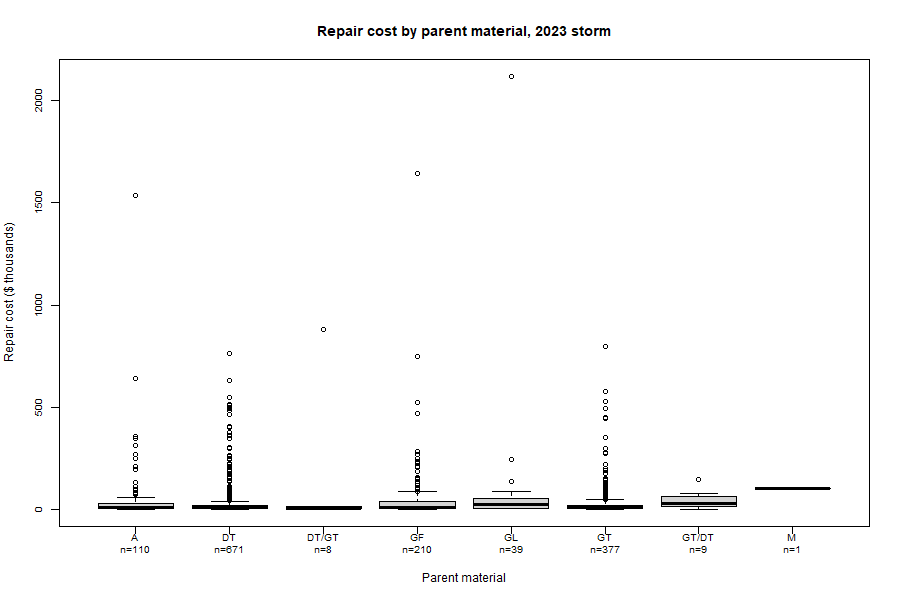
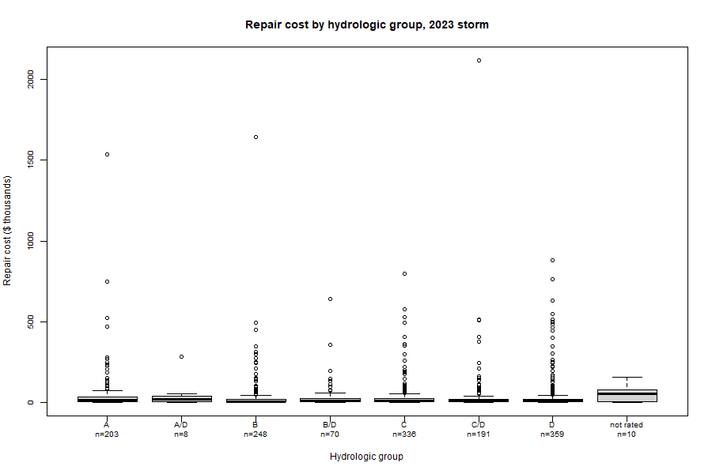
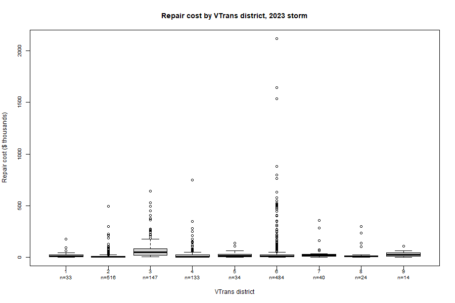
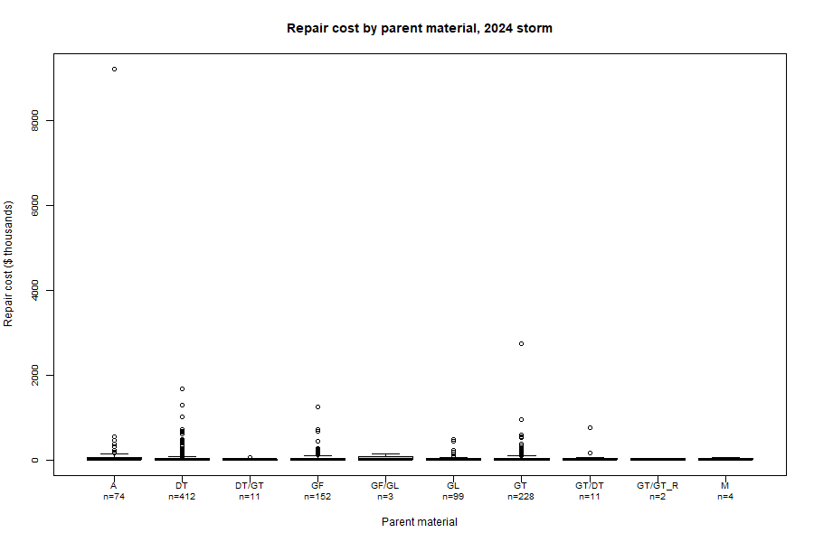
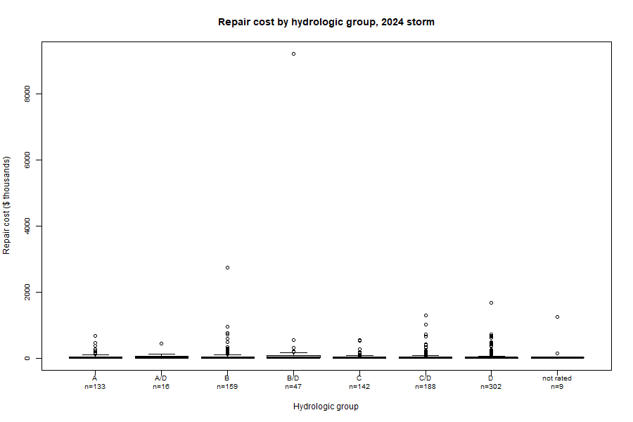
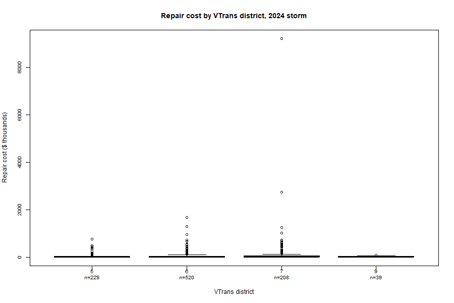

# Crosstab and ANOVA on Categoricals

The approach mirrors Dr. Wemple's homework assignments on crosstab and ANOVA, with the tables laid out as SPSS prints them.

## Script: crosstab_anova.R

```r
# Data:  ../mrgp-roads-core/twopart_simple_2026-09-17/data/analysis_<STORM>_2026-09-27.csv
#        one row per road segment; compliance-graded segments with at least 3.51 in of rain,
#        Averill excluded; damaged = 1 if the de-duplicated repair cost (cost_dedup) is above zero
# Hydrogroup, Parent, VTRANS District
# run from projects/reports: "C:/Program Files/R/R-4.5.3/bin/Rscript.exe" R/crosstab_anova.R

STORM <- 2023                                                   # which storm to run: 2023 or 2024

library(gmodels)                                                # CrossTable: the crosstab laid out the way SPSS prints it
library(car)                                                    # leveneTest: the equal-variances test SPSS prints with a one-way anova


# step 0  read the data
roads <- read.csv(paste0("../mrgp-roads-core/twopart_simple_2026-09-17/data/analysis_", STORM, "_2026-09-27.csv"))   # the storm's file
roads <- roads[roads$Precip >= 3.51 & roads$Town != "Averill", ]   # keep segments at or above the rain cutoff; drop Averill
roads$damaged <- ifelse(roads$cost_dedup > 0, 1, 0)             # damaged = 1 if any de-duplicated cost was recorded, else 0

roads$PARENT          <- factor(roads$PARENT)                   # the three categoricals as factors (district arrives as a number in the file)
roads$HYDROGROUP      <- factor(roads$HYDROGROUP)
roads$vtrans_district <- factor(roads$vtrans_district)

cat("storm", STORM, "\n")
cat("segments", nrow(roads), "\n")
cat("damaged", sum(roads$damaged), "\n")
cat("overall percent damaged", round(100 * mean(roads$damaged), 2), "\n")


# step 1  crosstabs: each cell shows count, expected count, row percent, residual (observed - expected)
cat("\nstep 1 parent material by damage\n")
CrossTable(roads$PARENT, roads$damaged, expected = TRUE, prop.r = TRUE, prop.c = FALSE, prop.t = FALSE,
           prop.chisq = FALSE, resid = TRUE, sresid = FALSE, asresid = FALSE, format = "SPSS")   # crosstab + pearson chi-square test

cat("\nstep 2 hydrologic group by damage\n")
CrossTable(roads$HYDROGROUP, roads$damaged, expected = TRUE, prop.r = TRUE, prop.c = FALSE, prop.t = FALSE,
           prop.chisq = FALSE, resid = TRUE, sresid = FALSE, asresid = FALSE, format = "SPSS")

cat("\nstep 3 vtrans district by damage\n")
CrossTable(roads$vtrans_district, roads$damaged, expected = TRUE, prop.r = TRUE, prop.c = FALSE, prop.t = FALSE,
           prop.chisq = FALSE, resid = TRUE, sresid = FALSE, asresid = FALSE, format = "SPSS")


# step 4  the cost side: damaged segments only, cost on the natural-log scale
dmg <- roads[roads$damaged == 1, ]                              # the damaged segments
dmg$log_cost <- log(dmg$cost_dedup)                             # ln(cost): the dollar amounts are too skewed for an anova as they are
dmg$cost_k   <- dmg$cost_dedup / 1000                           # cost in thousands of dollars, for the box plots
dmg$PARENT          <- factor(dmg$PARENT)                       # re-make the factors so categories with no damaged segments drop out
dmg$HYDROGROUP      <- factor(dmg$HYDROGROUP)
dmg$vtrans_district <- factor(dmg$vtrans_district)
cat("\nstep 4 damaged segments for the anova\n")
cat("damaged segments", nrow(dmg), "\n")
cat("mean ln(cost), all damaged", round(mean(dmg$log_cost), 3), "\n")


# step 5  one-way anova of ln(cost) by parent material, in SPSS's order: descriptives, levene, anova, bonferroni
cat("\nstep 5 ln(cost) by parent material\n")
groups <- levels(dmg$PARENT)                                    # the categories with damaged segments
desc <- data.frame(group = groups,
                   N             = as.integer(table(dmg$PARENT)),                              # damaged segments in each group
                   Mean          = aggregate(log_cost ~ PARENT, data = dmg, mean)$log_cost,    # mean ln(cost) in each group
                   Std_Deviation = aggregate(log_cost ~ PARENT, data = dmg, sd)$log_cost,
                   Minimum       = aggregate(log_cost ~ PARENT, data = dmg, min)$log_cost,
                   Maximum       = aggregate(log_cost ~ PARENT, data = dmg, max)$log_cost)
desc$Std_Error <- desc$Std_Deviation / sqrt(desc$N)              # standard error of each group mean
desc$Lower_95  <- desc$Mean - qt(0.975, pmax(desc$N - 1, 1)) * desc$Std_Error   # (a group of one segment has no sd, so its interval comes out NA)   # 95% confidence interval for the mean, lower
desc$Upper_95  <- desc$Mean + qt(0.975, pmax(desc$N - 1, 1)) * desc$Std_Error   # and upper
total <- data.frame(group = "Total", N = nrow(dmg), Mean = mean(dmg$log_cost), Std_Deviation = sd(dmg$log_cost),   # the all-groups row
                    Minimum = min(dmg$log_cost), Maximum = max(dmg$log_cost))
total$Std_Error <- total$Std_Deviation / sqrt(total$N)
total$Lower_95  <- total$Mean - qt(0.975, total$N - 1) * total$Std_Error
total$Upper_95  <- total$Mean + qt(0.975, total$N - 1) * total$Std_Error
shown <- rbind(desc, total)[, c("group", "N", "Mean", "Std_Deviation", "Std_Error", "Lower_95", "Upper_95", "Minimum", "Maximum")]   # SPSS column order
shown[, -1] <- round(shown[, -1], 3)
cat("\ndescriptives\n"); print(shown, row.names = FALSE)

cat("\ntest of homogeneity of variances\n"); print(leveneTest(log_cost ~ PARENT, data = dmg, center = mean))   # the anova assumes equal spread in every group

a <- anova(lm(log_cost ~ PARENT, data = dmg))                   # R's anova: row 1 the factor (between groups), row 2 residuals (within groups)
anova_table <- data.frame(Source         = c("Between Groups", "Within Groups", "Total"),
                          Sum_of_Squares = format(round(c(a[1, "Sum Sq"], a[2, "Sum Sq"], a[1, "Sum Sq"] + a[2, "Sum Sq"]), 3), nsmall = 3),
                          df             = c(a[1, "Df"], a[2, "Df"], a[1, "Df"] + a[2, "Df"]),
                          Mean_Square    = c(format(round(c(a[1, "Mean Sq"], a[2, "Mean Sq"]), 3), nsmall = 3), ""),   # blank where SPSS leaves a blank
                          F              = c(format(round(a[1, "F value"], 3), nsmall = 3), "", ""),
                          Sig            = c(format(round(a[1, "Pr(>F)"], 3), nsmall = 3), "", ""))
cat("\nanova\n"); print(anova_table, row.names = FALSE)

mse       <- a[2, "Mean Sq"]                                    # within-groups mean square: the pooled variance the comparisons use
df_within <- a[2, "Df"]                                         # its degrees of freedom
n_pairs   <- length(groups) * (length(groups) - 1) / 2          # number of pairs: the bonferroni multiplier
t_crit    <- qt(1 - 0.025 / n_pairs, df_within)                 # t value for the bonferroni-adjusted 95% interval
comparisons <- data.frame()                                     # one row per pair, filled in the loop (SPSS lists each pair twice; once here)
for (i in 1:(length(groups) - 1)) {
  for (j in (i + 1):length(groups)) {
    diff <- desc$Mean[i] - desc$Mean[j]                         # mean difference (I - J)
    se   <- sqrt(mse * (1 / desc$N[i] + 1 / desc$N[j]))         # its standard error from the pooled variance
    p    <- min(1, n_pairs * 2 * pt(-abs(diff / se), df_within))   # two-sided p times the number of pairs, capped at 1
    comparisons <- rbind(comparisons, data.frame(I = groups[i], J = groups[j], Mean_Difference = round(diff, 3), Std_Error = round(se, 3),
                                                 Sig = round(p, 3), Lower_95 = round(diff - t_crit * se, 3), Upper_95 = round(diff + t_crit * se, 3),
                                                 flag = ifelse(p < 0.05, "*", "")))   # * = the mean difference is significant at the .05 level
  }
}
cat("\nmultiple comparisons, bonferroni\n"); print(comparisons, row.names = FALSE)

png(paste0("figures/crosstab_anova_", STORM, "_fig1.png"), width = 900, height = 600)   # figure 1 to a file
boxplot(cost_k ~ PARENT, data = dmg, xlab = "Parent material", ylab = "Repair cost ($ thousands)",
        main = paste("Repair cost by parent material,", STORM, "storm"),
        names = paste0(groups, "\nn=", desc$N), cex.axis = 0.8)   # box = middle half of the values, line = median, whiskers = the rest, circles = outliers
invisible(dev.off())                                            # close the file without printing "null device"


# step 6  one-way anova of ln(cost) by hydrologic group
cat("\nstep 6 ln(cost) by hydrologic group\n")
groups <- levels(dmg$HYDROGROUP)
desc <- data.frame(group = groups,
                   N             = as.integer(table(dmg$HYDROGROUP)),
                   Mean          = aggregate(log_cost ~ HYDROGROUP, data = dmg, mean)$log_cost,
                   Std_Deviation = aggregate(log_cost ~ HYDROGROUP, data = dmg, sd)$log_cost,
                   Minimum       = aggregate(log_cost ~ HYDROGROUP, data = dmg, min)$log_cost,
                   Maximum       = aggregate(log_cost ~ HYDROGROUP, data = dmg, max)$log_cost)
desc$Std_Error <- desc$Std_Deviation / sqrt(desc$N)
desc$Lower_95  <- desc$Mean - qt(0.975, pmax(desc$N - 1, 1)) * desc$Std_Error   # (a group of one segment has no sd, so its interval comes out NA)
desc$Upper_95  <- desc$Mean + qt(0.975, pmax(desc$N - 1, 1)) * desc$Std_Error
shown <- rbind(desc, total)[, c("group", "N", "Mean", "Std_Deviation", "Std_Error", "Lower_95", "Upper_95", "Minimum", "Maximum")]   # the Total row is the same for every grouping
shown[, -1] <- round(shown[, -1], 3)
cat("\ndescriptives\n"); print(shown, row.names = FALSE)

cat("\ntest of homogeneity of variances\n"); print(leveneTest(log_cost ~ HYDROGROUP, data = dmg, center = mean))

a <- anova(lm(log_cost ~ HYDROGROUP, data = dmg))
anova_table <- data.frame(Source         = c("Between Groups", "Within Groups", "Total"),
                          Sum_of_Squares = format(round(c(a[1, "Sum Sq"], a[2, "Sum Sq"], a[1, "Sum Sq"] + a[2, "Sum Sq"]), 3), nsmall = 3),
                          df             = c(a[1, "Df"], a[2, "Df"], a[1, "Df"] + a[2, "Df"]),
                          Mean_Square    = c(format(round(c(a[1, "Mean Sq"], a[2, "Mean Sq"]), 3), nsmall = 3), ""),   # blank where SPSS leaves a blank
                          F              = c(format(round(a[1, "F value"], 3), nsmall = 3), "", ""),
                          Sig            = c(format(round(a[1, "Pr(>F)"], 3), nsmall = 3), "", ""))
cat("\nanova\n"); print(anova_table, row.names = FALSE)

mse       <- a[2, "Mean Sq"]
df_within <- a[2, "Df"]
n_pairs   <- length(groups) * (length(groups) - 1) / 2
t_crit    <- qt(1 - 0.025 / n_pairs, df_within)
comparisons <- data.frame()
for (i in 1:(length(groups) - 1)) {
  for (j in (i + 1):length(groups)) {
    diff <- desc$Mean[i] - desc$Mean[j]
    se   <- sqrt(mse * (1 / desc$N[i] + 1 / desc$N[j]))
    p    <- min(1, n_pairs * 2 * pt(-abs(diff / se), df_within))
    comparisons <- rbind(comparisons, data.frame(I = groups[i], J = groups[j], Mean_Difference = round(diff, 3), Std_Error = round(se, 3),
                                                 Sig = round(p, 3), Lower_95 = round(diff - t_crit * se, 3), Upper_95 = round(diff + t_crit * se, 3),
                                                 flag = ifelse(p < 0.05, "*", "")))
  }
}
cat("\nmultiple comparisons, bonferroni\n"); print(comparisons, row.names = FALSE)

png(paste0("figures/crosstab_anova_", STORM, "_fig2.png"), width = 900, height = 600)   # figure 2 to a file
boxplot(cost_k ~ HYDROGROUP, data = dmg, xlab = "Hydrologic group", ylab = "Repair cost ($ thousands)",
        main = paste("Repair cost by hydrologic group,", STORM, "storm"),
        names = paste0(groups, "\nn=", desc$N), cex.axis = 0.8)
invisible(dev.off())                                            # close the file without printing "null device"


# step 7  one-way anova of ln(cost) by vtrans district
cat("\nstep 7 ln(cost) by vtrans district\n")
groups <- levels(dmg$vtrans_district)
desc <- data.frame(group = groups,
                   N             = as.integer(table(dmg$vtrans_district)),
                   Mean          = aggregate(log_cost ~ vtrans_district, data = dmg, mean)$log_cost,
                   Std_Deviation = aggregate(log_cost ~ vtrans_district, data = dmg, sd)$log_cost,
                   Minimum       = aggregate(log_cost ~ vtrans_district, data = dmg, min)$log_cost,
                   Maximum       = aggregate(log_cost ~ vtrans_district, data = dmg, max)$log_cost)
desc$Std_Error <- desc$Std_Deviation / sqrt(desc$N)
desc$Lower_95  <- desc$Mean - qt(0.975, pmax(desc$N - 1, 1)) * desc$Std_Error   # (a group of one segment has no sd, so its interval comes out NA)
desc$Upper_95  <- desc$Mean + qt(0.975, pmax(desc$N - 1, 1)) * desc$Std_Error
shown <- rbind(desc, total)[, c("group", "N", "Mean", "Std_Deviation", "Std_Error", "Lower_95", "Upper_95", "Minimum", "Maximum")]
shown[, -1] <- round(shown[, -1], 3)
cat("\ndescriptives\n"); print(shown, row.names = FALSE)

cat("\ntest of homogeneity of variances\n"); print(leveneTest(log_cost ~ vtrans_district, data = dmg, center = mean))

a <- anova(lm(log_cost ~ vtrans_district, data = dmg))
anova_table <- data.frame(Source         = c("Between Groups", "Within Groups", "Total"),
                          Sum_of_Squares = format(round(c(a[1, "Sum Sq"], a[2, "Sum Sq"], a[1, "Sum Sq"] + a[2, "Sum Sq"]), 3), nsmall = 3),
                          df             = c(a[1, "Df"], a[2, "Df"], a[1, "Df"] + a[2, "Df"]),
                          Mean_Square    = c(format(round(c(a[1, "Mean Sq"], a[2, "Mean Sq"]), 3), nsmall = 3), ""),   # blank where SPSS leaves a blank
                          F              = c(format(round(a[1, "F value"], 3), nsmall = 3), "", ""),
                          Sig            = c(format(round(a[1, "Pr(>F)"], 3), nsmall = 3), "", ""))
cat("\nanova\n"); print(anova_table, row.names = FALSE)

mse       <- a[2, "Mean Sq"]
df_within <- a[2, "Df"]
n_pairs   <- length(groups) * (length(groups) - 1) / 2
t_crit    <- qt(1 - 0.025 / n_pairs, df_within)
comparisons <- data.frame()
for (i in 1:(length(groups) - 1)) {
  for (j in (i + 1):length(groups)) {
    diff <- desc$Mean[i] - desc$Mean[j]
    se   <- sqrt(mse * (1 / desc$N[i] + 1 / desc$N[j]))
    p    <- min(1, n_pairs * 2 * pt(-abs(diff / se), df_within))
    comparisons <- rbind(comparisons, data.frame(I = groups[i], J = groups[j], Mean_Difference = round(diff, 3), Std_Error = round(se, 3),
                                                 Sig = round(p, 3), Lower_95 = round(diff - t_crit * se, 3), Upper_95 = round(diff + t_crit * se, 3),
                                                 flag = ifelse(p < 0.05, "*", "")))
  }
}
cat("\nmultiple comparisons, bonferroni\n"); print(comparisons, row.names = FALSE)

png(paste0("figures/crosstab_anova_", STORM, "_fig3.png"), width = 900, height = 600)   # figure 3 to a file
boxplot(cost_k ~ vtrans_district, data = dmg, xlab = "VTrans district", ylab = "Repair cost ($ thousands)",
        main = paste("Repair cost by VTrans district,", STORM, "storm"),
        names = paste0(groups, "\nn=", desc$N), cex.axis = 0.8)
invisible(dev.off())                                            # close the file without printing "null device"
```

## Output 2023

```
storm 2023 
segments 59695 
damaged 1425 
overall percent damaged 2.39 

step 1 parent material by damage

   Cell Contents
|-------------------------|
|                   Count |
|         Expected Values |
|             Row Percent |
|                Residual |
|-------------------------|

Total Observations in Table:  59695 

             | roads$damaged 
roads$PARENT |        0  |        1  | Row Total | 
-------------|-----------|-----------|-----------|
           A |     2394  |      110  |     2504  | 
             | 2444.226  |   59.774  |           | 
             |   95.607% |    4.393% |    4.195% | 
             |  -50.226  |   50.226  |           | 
-------------|-----------|-----------|-----------|
          DT |    23849  |      671  |    24520  | 
             | 23934.675  |  585.325  |           | 
             |   97.263% |    2.737% |   41.075% | 
             |  -85.675  |   85.675  |           | 
-------------|-----------|-----------|-----------|
       DT/GT |      169  |        8  |      177  | 
             |  172.775  |    4.225  |           | 
             |   95.480% |    4.520% |    0.297% | 
             |   -3.775  |    3.775  |           | 
-------------|-----------|-----------|-----------|
          GF |     9950  |      210  |    10160  | 
             | 9917.467  |  242.533  |           | 
             |   97.933% |    2.067% |   17.020% | 
             |   32.533  |  -32.533  |           | 
-------------|-----------|-----------|-----------|
          GL |     2460  |       39  |     2499  | 
             | 2439.346  |   59.654  |           | 
             |   98.439% |    1.561% |    4.186% | 
             |   20.654  |  -20.654  |           | 
-------------|-----------|-----------|-----------|
          GT |    17776  |      377  |    18153  | 
             | 17719.663  |  433.337  |           | 
             |   97.923% |    2.077% |   30.410% | 
             |   56.337  |  -56.337  |           | 
-------------|-----------|-----------|-----------|
       GT/DT |     1509  |        9  |     1518  | 
             | 1481.763  |   36.237  |           | 
             |   99.407% |    0.593% |    2.543% | 
             |   27.237  |  -27.237  |           | 
-------------|-----------|-----------|-----------|
           M |      163  |        1  |      164  | 
             |  160.085  |    3.915  |           | 
             |   99.390% |    0.610% |    0.275% | 
             |    2.915  |   -2.915  |           | 
-------------|-----------|-----------|-----------|
Column Total |    58270  |     1425  |    59695  | 
-------------|-----------|-----------|-----------|

 
Statistics for All Table Factors


Pearson's Chi-squared test 
------------------------------------------------------------
Chi^2 =  102.0335     d.f. =  7     p =  4.100164e-19 


 
       Minimum expected frequency: 3.914901 
Cells with Expected Frequency < 5: 2 of 16 (12.5%)

Warning message:
In chisq.test(t, correct = FALSE, ...) :
  Chi-squared approximation may be incorrect

step 2 hydrologic group by damage

   Cell Contents
|-------------------------|
|                   Count |
|         Expected Values |
|             Row Percent |
|                Residual |
|-------------------------|

Total Observations in Table:  59695 

                 | roads$damaged 
roads$HYDROGROUP |        0  |        1  | Row Total | 
-----------------|-----------|-----------|-----------|
               A |     9353  |      203  |     9556  | 
                 | 9327.885  |  228.115  |           | 
                 |   97.876% |    2.124% |   16.008% | 
                 |   25.115  |  -25.115  |           | 
-----------------|-----------|-----------|-----------|
             A/D |      745  |        8  |      753  | 
                 |  735.025  |   17.975  |           | 
                 |   98.938% |    1.062% |    1.261% | 
                 |    9.975  |   -9.975  |           | 
-----------------|-----------|-----------|-----------|
               B |     8316  |      248  |     8564  | 
                 | 8359.566  |  204.434  |           | 
                 |   97.104% |    2.896% |   14.346% | 
                 |  -43.566  |   43.566  |           | 
-----------------|-----------|-----------|-----------|
             B/D |     1981  |       70  |     2051  | 
                 | 2002.040  |   48.960  |           | 
                 |   96.587% |    3.413% |    3.436% | 
                 |  -21.040  |   21.040  |           | 
-----------------|-----------|-----------|-----------|
               C |    14079  |      336  |    14415  | 
                 | 14070.895  |  344.105  |           | 
                 |   97.669% |    2.331% |   24.148% | 
                 |    8.105  |   -8.105  |           | 
-----------------|-----------|-----------|-----------|
             C/D |     9333  |      191  |     9524  | 
                 | 9296.649  |  227.351  |           | 
                 |   97.995% |    2.005% |   15.954% | 
                 |   36.351  |  -36.351  |           | 
-----------------|-----------|-----------|-----------|
               D |    14184  |      359  |    14543  | 
                 | 14195.839  |  347.161  |           | 
                 |   97.531% |    2.469% |   24.362% | 
                 |  -11.839  |   11.839  |           | 
-----------------|-----------|-----------|-----------|
       not rated |      279  |       10  |      289  | 
                 |  282.101  |    6.899  |           | 
                 |   96.540% |    3.460% |    0.484% | 
                 |   -3.101  |    3.101  |           | 
-----------------|-----------|-----------|-----------|
    Column Total |    58270  |     1425  |    59695  | 
-----------------|-----------|-----------|-----------|

 
Statistics for All Table Factors


Pearson's Chi-squared test 
------------------------------------------------------------
Chi^2 =  35.26892     d.f. =  7     p =  9.955103e-06 


 
       Minimum expected frequency: 6.898819 


step 3 vtrans district by damage

   Cell Contents
|-------------------------|
|                   Count |
|         Expected Values |
|             Row Percent |
|                Residual |
|-------------------------|

Total Observations in Table:  59695 

                      | roads$damaged 
roads$vtrans_district |        0  |        1  | Row Total | 
----------------------|-----------|-----------|-----------|
                    1 |     6046  |       33  |     6079  | 
                      | 5933.886  |  145.114  |           | 
                      |   99.457% |    0.543% |   10.183% | 
                      |  112.114  | -112.114  |           | 
----------------------|-----------|-----------|-----------|
                    2 |     6073  |      516  |     6589  | 
                      | 6431.712  |  157.288  |           | 
                      |   92.169% |    7.831% |   11.038% | 
                      | -358.712  |  358.712  |           | 
----------------------|-----------|-----------|-----------|
                    3 |    10360  |      147  |    10507  | 
                      | 10256.184  |  250.816  |           | 
                      |   98.601% |    1.399% |   17.601% | 
                      |  103.816  | -103.816  |           | 
----------------------|-----------|-----------|-----------|
                    4 |    10429  |      133  |    10562  | 
                      | 10309.871  |  252.129  |           | 
                      |   98.741% |    1.259% |   17.693% | 
                      |  119.129  | -119.129  |           | 
----------------------|-----------|-----------|-----------|
                    5 |     2646  |       34  |     2680  | 
                      | 2616.025  |   63.975  |           | 
                      |   98.731% |    1.269% |    4.489% | 
                      |   29.975  |  -29.975  |           | 
----------------------|-----------|-----------|-----------|
                    6 |     9671  |      484  |    10155  | 
                      | 9912.586  |  242.414  |           | 
                      |   95.234% |    4.766% |   17.011% | 
                      | -241.586  |  241.586  |           | 
----------------------|-----------|-----------|-----------|
                    7 |     3618  |       40  |     3658  | 
                      | 3570.679  |   87.321  |           | 
                      |   98.907% |    1.093% |    6.128% | 
                      |   47.321  |  -47.321  |           | 
----------------------|-----------|-----------|-----------|
                    8 |     4197  |       24  |     4221  | 
                      | 4120.239  |  100.761  |           | 
                      |   99.431% |    0.569% |    7.071% | 
                      |   76.761  |  -76.761  |           | 
----------------------|-----------|-----------|-----------|
                    9 |     5230  |       14  |     5244  | 
                      | 5118.819  |  125.181  |           | 
                      |   99.733% |    0.267% |    8.785% | 
                      |  111.181  | -111.181  |           | 
----------------------|-----------|-----------|-----------|
         Column Total |    58270  |     1425  |    59695  | 
----------------------|-----------|-----------|-----------|

 
Statistics for All Table Factors


Pearson's Chi-squared test 
------------------------------------------------------------
Chi^2 =  1476.886     d.f. =  8     p =  1.339118e-313 


 
       Minimum expected frequency: 63.97521 


step 4 damaged segments for the anova
damaged segments 1425 
mean ln(cost), all damaged 8.885 

step 5 ln(cost) by parent material

descriptives
 group    N   Mean Std_Deviation Std_Error Lower_95 Upper_95 Minimum Maximum
     A  110  9.185         1.905     0.182    8.825    9.545   3.332  14.246
    DT  671  8.720         1.884     0.073    8.578    8.863   3.466  13.547
 DT/GT    8  8.905         2.119     0.749    7.134   10.677   7.249  13.688
    GF  210  9.314         1.825     0.126    9.066    9.562   4.844  14.314
    GL   39  9.773         1.657     0.265    9.236   10.310   7.238  14.567
    GT  377  8.728         1.806     0.093    8.546    8.911   3.871  13.591
 GT/DT    9  9.821         1.841     0.614    8.406   11.236   6.410  11.885
     M    1 11.521            NA        NA       NA       NA  11.521  11.521
 Total 1425  8.885         1.870     0.050    8.787    8.982   3.332  14.567

test of homogeneity of variances
Levene's Test for Homogeneity of Variance (center = mean)
        Df F value Pr(>F)
group    7  0.4912 0.8415
      1417               

anova
         Source Sum_of_Squares   df Mean_Square     F   Sig
 Between Groups        121.566    7      17.367 5.065 0.000
  Within Groups       4858.723 1417       3.429            
          Total       4980.288 1424                        

multiple comparisons, bonferroni
     I     J Mean_Difference Std_Error   Sig Lower_95 Upper_95 flag
     A    DT           0.464     0.190 0.417   -0.132    1.061     
     A DT/GT           0.280     0.678 1.000   -1.843    2.402     
     A    GF          -0.129     0.218 1.000   -0.811    0.553     
     A    GL          -0.588     0.345 1.000   -1.668    0.492     
     A    GT           0.456     0.201 0.647   -0.172    1.084     
     A GT/DT          -0.637     0.642 1.000   -2.646    1.373     
     A     M          -2.336     1.860 1.000   -8.157    3.486     
    DT DT/GT          -0.185     0.659 1.000   -2.246    1.876     
    DT    GF          -0.594     0.146 0.001   -1.052   -0.135    *
    DT    GL          -1.053     0.305 0.016   -2.007   -0.098    *
    DT    GT          -0.008     0.119 1.000   -0.381    0.365     
    DT GT/DT          -1.101     0.621 1.000   -3.046    0.844     
    DT     M          -2.800     1.853 1.000   -8.600    2.999     
 DT/GT    GF          -0.409     0.667 1.000   -2.496    1.679     
 DT/GT    GL          -0.868     0.719 1.000   -3.117    1.381     
 DT/GT    GT           0.177     0.662 1.000   -1.894    2.247     
 DT/GT GT/DT          -0.916     0.900 1.000   -3.732    1.900     
 DT/GT     M          -2.615     1.964 1.000   -8.762    3.531     
    GF    GL          -0.459     0.323 1.000   -1.470    0.551     
    GF    GT           0.586     0.159 0.007    0.087    1.085    *
    GF GT/DT          -0.507     0.630 1.000   -2.480    1.465     
    GF     M          -2.207     1.856 1.000   -8.016    3.602     
    GL    GT           1.045     0.311 0.023    0.070    2.020    *
    GL GT/DT          -0.048     0.685 1.000   -2.191    2.095     
    GL     M          -1.747     1.875 1.000   -7.617    4.122     
    GT GT/DT          -1.093     0.625 1.000   -3.047    0.862     
    GT     M          -2.792     1.854 1.000   -8.595    3.011     
 GT/DT     M          -1.699     1.952 1.000   -7.808    4.409     

step 6 ln(cost) by hydrologic group

descriptives
     group    N  Mean Std_Deviation Std_Error Lower_95 Upper_95 Minimum Maximum
         A  203 9.327         1.772     0.124    9.082    9.572   4.605  14.246
       A/D    8 9.415         2.146     0.759    7.621   11.209   5.247  12.551
         B  248 8.596         1.898     0.121    8.359    8.833   4.554  14.314
       B/D   70 9.142         1.809     0.216    8.711    9.573   3.332  13.372
         C  336 8.735         1.912     0.104    8.530    8.940   3.871  13.591
       C/D  191 8.773         1.924     0.139    8.498    9.048   4.143  14.567
         D  359 8.945         1.787     0.094    8.759    9.130   3.466  13.688
 not rated   10 9.824         2.098     0.663    8.323   11.325   5.565  11.948
     Total 1425 8.885         1.870     0.050    8.787    8.982   3.332  14.567

test of homogeneity of variances
Levene's Test for Homogeneity of Variance (center = mean)
        Df F value Pr(>F)
group    7  0.9584 0.4603
      1417               

anova
         Source Sum_of_Squares   df Mean_Square     F   Sig
 Between Groups         87.283    7      12.469 3.611 0.001
  Within Groups       4893.005 1417       3.453            
          Total       4980.288 1424                        

multiple comparisons, bonferroni
   I         J Mean_Difference Std_Error   Sig Lower_95 Upper_95 flag
   A       A/D          -0.088     0.670 1.000   -2.185    2.008     
   A         B           0.731     0.176 0.001    0.180    1.281    *
   A       B/D           0.185     0.258 1.000   -0.621    0.991     
   A         C           0.592     0.165 0.010    0.075    1.109    *
   A       C/D           0.554     0.187 0.088   -0.032    1.140     
   A         D           0.382     0.163 0.543   -0.129    0.893     
   A not rated          -0.497     0.602 1.000   -2.381    1.387     
 A/D         B           0.819     0.668 1.000   -1.270    2.908     
 A/D       B/D           0.273     0.694 1.000   -1.897    2.444     
 A/D         C           0.680     0.665 1.000   -1.400    2.761     
 A/D       C/D           0.642     0.671 1.000   -1.457    2.741     
 A/D         D           0.470     0.664 1.000   -1.609    2.549     
 A/D not rated          -0.409     0.881 1.000   -3.168    2.350     
   B       B/D          -0.546     0.252 0.843   -1.333    0.241     
   B         C          -0.139     0.156 1.000   -0.626    0.348     
   B       C/D          -0.177     0.179 1.000   -0.737    0.383     
   B         D          -0.349     0.153 0.646   -0.829    0.131     
   B not rated          -1.228     0.599 1.000   -3.104    0.648     
 B/D         C           0.407     0.244 1.000   -0.357    1.171     
 B/D       C/D           0.369     0.260 1.000   -0.444    1.182     
 B/D         D           0.197     0.243 1.000   -0.563    0.957     
 B/D not rated          -0.682     0.628 1.000   -2.648    1.284     
   C       C/D          -0.038     0.168 1.000   -0.565    0.489     
   C         D          -0.210     0.141 1.000   -0.651    0.232     
   C not rated          -1.089     0.596 1.000   -2.955    0.777     
 C/D         D          -0.172     0.166 1.000   -0.693    0.349     
 C/D not rated          -1.051     0.603 1.000   -2.938    0.835     
   D not rated          -0.879     0.596 1.000   -2.744    0.985     

step 7 ln(cost) by vtrans district

descriptives
 group    N   Mean Std_Deviation Std_Error Lower_95 Upper_95 Minimum Maximum
     1   33  9.184         1.265     0.220    8.735    9.633   6.807  12.082
     2  516  7.903         1.760     0.077    7.751    8.055   3.871  13.112
     3  147 10.700         1.091     0.090   10.522   10.878   7.129  13.372
     4  133  8.826         1.881     0.163    8.504    9.149   4.605  13.528
     5   34  9.122         1.710     0.293    8.525    9.718   4.344  11.829
     6  484  9.293         1.626     0.074    9.148    9.439   4.001  14.567
     7   40  9.517         1.572     0.249    9.014   10.020   3.466  12.785
     8   24  8.899         1.804     0.368    8.137    9.661   6.428  12.605
     9   14  9.313         2.177     0.582    8.056   10.569   3.332  11.589
 Total 1425  8.885         1.870     0.050    8.787    8.982   3.332  14.567

test of homogeneity of variances
Levene's Test for Homogeneity of Variance (center = mean)
        Df F value   Pr(>F)    
group    8  7.0001 4.34e-09 ***
      1416                     
---
Signif. codes:  0 '***' 0.001 '**' 0.01 '*' 0.05 '.' 0.1 ' ' 1

anova
         Source Sum_of_Squares   df Mean_Square      F   Sig
 Between Groups       1086.673    8     135.834 49.399 0.000
  Within Groups       3893.616 1416       2.750             
          Total       4980.288 1424                         

multiple comparisons, bonferroni
 I J Mean_Difference Std_Error   Sig Lower_95 Upper_95 flag
 1 2           1.281     0.298 0.001    0.327    2.235    *
 1 3          -1.516     0.319 0.000   -2.539   -0.493    *
 1 4           0.358     0.322 1.000   -0.675    1.391     
 1 5           0.062     0.405 1.000   -1.236    1.360     
 1 6          -0.109     0.298 1.000   -1.065    0.846     
 1 7          -0.333     0.390 1.000   -1.582    0.916     
 1 8           0.285     0.445 1.000   -1.140    1.710     
 1 9          -0.129     0.529 1.000   -1.823    1.566     
 2 3          -2.797     0.155 0.000   -3.294   -2.301    *
 2 4          -0.924     0.161 0.000   -1.440   -0.407    *
 2 5          -1.219     0.294 0.001   -2.159   -0.278    *
 2 6          -1.391     0.105 0.000   -1.727   -1.054    *
 2 7          -1.614     0.272 0.000   -2.486   -0.743    *
 2 8          -0.997     0.346 0.146   -2.106    0.113     
 2 9          -1.410     0.449 0.062   -2.849    0.029     
 3 4           1.874     0.198 0.000    1.238    2.509    *
 3 5           1.578     0.316 0.000    0.568    2.589    *
 3 6           1.407     0.156 0.000    0.906    1.907    *
 3 7           1.183     0.296 0.002    0.236    2.130    *
 3 8           1.801     0.365 0.000    0.631    2.970    *
 3 9           1.387     0.464 0.102   -0.098    2.873     
 4 5          -0.295     0.319 1.000   -1.316    0.726     
 4 6          -0.467     0.162 0.147   -0.987    0.053     
 4 7          -0.691     0.299 0.757   -1.649    0.267     
 4 8          -0.073     0.368 1.000   -1.251    1.105     
 4 9          -0.486     0.466 1.000   -1.979    1.006     
 5 6          -0.172     0.294 1.000   -1.114    0.771     
 5 7          -0.396     0.387 1.000   -1.635    0.843     
 5 8           0.222     0.442 1.000   -1.194    1.638     
 5 9          -0.191     0.527 1.000   -1.878    1.496     
 6 7          -0.224     0.273 1.000   -1.098    0.650     
 6 8           0.394     0.347 1.000   -0.717    1.505     
 6 9          -0.019     0.450 1.000   -1.459    1.421     
 7 8           0.618     0.428 1.000   -0.754    1.989     
 7 9           0.205     0.515 1.000   -1.445    1.854     
 8 9          -0.413     0.558 1.000   -2.200    1.373     
```

### Figures 2023: repair cost box-and-whisker plots







## Output 2024

```
storm 2024 
segments 22571 
damaged 996 
overall percent damaged 4.41 

step 1 parent material by damage

   Cell Contents
|-------------------------|
|                   Count |
|         Expected Values |
|             Row Percent |
|                Residual |
|-------------------------|

Total Observations in Table:  22571 

             | roads$damaged 
roads$PARENT |        0  |        1  | Row Total | 
-------------|-----------|-----------|-----------|
           A |      931  |       74  |     1005  | 
             |  960.652  |   44.348  |           | 
             |   92.637% |    7.363% |    4.453% | 
             |  -29.652  |   29.652  |           | 
-------------|-----------|-----------|-----------|
          DT |     8123  |      412  |     8535  | 
             | 8158.372  |  376.628  |           | 
             |   95.173% |    4.827% |   37.814% | 
             |  -35.372  |   35.372  |           | 
-------------|-----------|-----------|-----------|
       DT/GT |      123  |       11  |      134  | 
             |  128.087  |    5.913  |           | 
             |   91.791% |    8.209% |    0.594% | 
             |   -5.087  |    5.087  |           | 
-------------|-----------|-----------|-----------|
          GF |     2759  |      152  |     2911  | 
             | 2782.545  |  128.455  |           | 
             |   94.778% |    5.222% |   12.897% | 
             |  -23.545  |   23.545  |           | 
-------------|-----------|-----------|-----------|
       GF/GL |      101  |        3  |      104  | 
             |   99.411  |    4.589  |           | 
             |   97.115% |    2.885% |    0.461% | 
             |    1.589  |   -1.589  |           | 
-------------|-----------|-----------|-----------|
          GL |     3274  |       99  |     3373  | 
             | 3224.158  |  148.842  |           | 
             |   97.065% |    2.935% |   14.944% | 
             |   49.842  |  -49.842  |           | 
-------------|-----------|-----------|-----------|
          GT |     5446  |      228  |     5674  | 
             | 5423.621  |  250.379  |           | 
             |   95.982% |    4.018% |   25.138% | 
             |   22.379  |  -22.379  |           | 
-------------|-----------|-----------|-----------|
       GT/DT |      704  |       11  |      715  | 
             |  683.449  |   31.551  |           | 
             |   98.462% |    1.538% |    3.168% | 
             |   20.551  |  -20.551  |           | 
-------------|-----------|-----------|-----------|
     GT/GT_R |       89  |        2  |       91  | 
             |   86.984  |    4.016  |           | 
             |   97.802% |    2.198% |    0.403% | 
             |    2.016  |   -2.016  |           | 
-------------|-----------|-----------|-----------|
           M |       25  |        4  |       29  | 
             |   27.720  |    1.280  |           | 
             |   86.207% |   13.793% |    0.128% | 
             |   -2.720  |    2.720  |           | 
-------------|-----------|-----------|-----------|
Column Total |    21575  |      996  |    22571  | 
-------------|-----------|-----------|-----------|

 
Statistics for All Table Factors


Pearson's Chi-squared test 
------------------------------------------------------------
Chi^2 =  74.55099     d.f. =  9     p =  1.938057e-12 


 
       Minimum expected frequency: 1.279695 
Cells with Expected Frequency < 5: 3 of 20 (15%)

Warning message:
In chisq.test(t, correct = FALSE, ...) :
  Chi-squared approximation may be incorrect

step 2 hydrologic group by damage

   Cell Contents
|-------------------------|
|                   Count |
|         Expected Values |
|             Row Percent |
|                Residual |
|-------------------------|

Total Observations in Table:  22571 

                 | roads$damaged 
roads$HYDROGROUP |        0  |        1  | Row Total | 
-----------------|-----------|-----------|-----------|
               A |     2271  |      133  |     2404  | 
                 | 2297.918  |  106.082  |           | 
                 |   94.468% |    5.532% |   10.651% | 
                 |  -26.918  |   26.918  |           | 
-----------------|-----------|-----------|-----------|
             A/D |      346  |       16  |      362  | 
                 |  346.026  |   15.974  |           | 
                 |   95.580% |    4.420% |    1.604% | 
                 |   -0.026  |    0.026  |           | 
-----------------|-----------|-----------|-----------|
               B |     2884  |      159  |     3043  | 
                 | 2908.720  |  134.280  |           | 
                 |   94.775% |    5.225% |   13.482% | 
                 |  -24.720  |   24.720  |           | 
-----------------|-----------|-----------|-----------|
             B/D |      777  |       47  |      824  | 
                 |  787.639  |   36.361  |           | 
                 |   94.296% |    5.704% |    3.651% | 
                 |  -10.639  |   10.639  |           | 
-----------------|-----------|-----------|-----------|
               C |     3905  |      142  |     4047  | 
                 | 3868.416  |  178.584  |           | 
                 |   96.491% |    3.509% |   17.930% | 
                 |   36.584  |  -36.584  |           | 
-----------------|-----------|-----------|-----------|
             C/D |     3332  |      188  |     3520  | 
                 | 3364.671  |  155.329  |           | 
                 |   94.659% |    5.341% |   15.595% | 
                 |  -32.671  |   32.671  |           | 
-----------------|-----------|-----------|-----------|
               D |     7854  |      302  |     8156  | 
                 | 7796.097  |  359.903  |           | 
                 |   96.297% |    3.703% |   36.135% | 
                 |   57.903  |  -57.903  |           | 
-----------------|-----------|-----------|-----------|
       not rated |      206  |        9  |      215  | 
                 |  205.513  |    9.487  |           | 
                 |   95.814% |    4.186% |    0.953% | 
                 |    0.487  |   -0.487  |           | 
-----------------|-----------|-----------|-----------|
    Column Total |    21575  |      996  |    22571  | 
-----------------|-----------|-----------|-----------|

 
Statistics for All Table Factors


Pearson's Chi-squared test 
------------------------------------------------------------
Chi^2 =  39.96477     d.f. =  7     p =  1.278483e-06 


 
       Minimum expected frequency: 9.487395 


step 3 vtrans district by damage

   Cell Contents
|-------------------------|
|                   Count |
|         Expected Values |
|             Row Percent |
|                Residual |
|-------------------------|

Total Observations in Table:  22571 

                      | roads$damaged 
roads$vtrans_district |        0  |        1  | Row Total | 
----------------------|-----------|-----------|-----------|
                    3 |      137  |        0  |      137  | 
                      |  130.955  |    6.045  |           | 
                      |  100.000% |    0.000% |    0.607% | 
                      |    6.045  |   -6.045  |           | 
----------------------|-----------|-----------|-----------|
                    5 |     5269  |      229  |     5498  | 
                      | 5255.387  |  242.613  |           | 
                      |   95.835% |    4.165% |   24.359% | 
                      |   13.613  |  -13.613  |           | 
----------------------|-----------|-----------|-----------|
                    6 |     5943  |      520  |     6463  | 
                      | 6177.804  |  285.196  |           | 
                      |   91.954% |    8.046% |   28.634% | 
                      | -234.804  |  234.804  |           | 
----------------------|-----------|-----------|-----------|
                    7 |     7035  |      208  |     7243  | 
                      | 6923.385  |  319.615  |           | 
                      |   97.128% |    2.872% |   32.090% | 
                      |  111.615  | -111.615  |           | 
----------------------|-----------|-----------|-----------|
                    8 |      174  |        0  |      174  | 
                      |  166.322  |    7.678  |           | 
                      |  100.000% |    0.000% |    0.771% | 
                      |    7.678  |   -7.678  |           | 
----------------------|-----------|-----------|-----------|
                    9 |     3017  |       39  |     3056  | 
                      | 2921.147  |  134.853  |           | 
                      |   98.724% |    1.276% |   13.539% | 
                      |   95.853  |  -95.853  |           | 
----------------------|-----------|-----------|-----------|
         Column Total |    21575  |      996  |    22571  | 
----------------------|-----------|-----------|-----------|

 
Statistics for All Table Factors


Pearson's Chi-squared test 
------------------------------------------------------------
Chi^2 =  329.4524     d.f. =  5     p =  4.632049e-69 


 
       Minimum expected frequency: 6.045457 


step 4 damaged segments for the anova
damaged segments 996 
mean ln(cost), all damaged 9.508 

step 5 ln(cost) by parent material

descriptives
   group   N   Mean Std_Deviation Std_Error Lower_95 Upper_95 Minimum Maximum
       A  74  9.892         1.787     0.208    9.478   10.306   5.434  16.037
      DT 412  9.472         1.609     0.079    9.316    9.628   5.247  14.331
   DT/GT  11  9.099         1.316     0.397    8.215    9.982   6.752  11.082
      GF 152  9.582         1.636     0.133    9.320    9.844   4.984  14.037
   GF/GL   3 10.443         1.176     0.679    7.521   13.365   9.764  11.801
      GL  99  9.139         1.529     0.154    8.834    9.444   4.605  13.109
      GT 228  9.558         1.582     0.105    9.351    9.764   5.808  14.825
   GT/DT  11  9.747         2.111     0.637    8.328   11.165   6.260  13.535
 GT/GT_R   2  9.245         1.360     0.962   -2.978   21.469   8.283  10.207
       M   4  9.599         1.212     0.606    7.670   11.529   8.454  10.963
   Total 996  9.508         1.617     0.051    9.408    9.609   4.605  16.037

test of homogeneity of variances
Levene's Test for Homogeneity of Variance (center = mean)
       Df F value Pr(>F)
group   9  0.7064 0.7035
      986               

anova
         Source Sum_of_Squares  df Mean_Square     F   Sig
 Between Groups         31.590   9       3.510 1.347 0.208
  Within Groups       2569.335 986       2.606            
          Total       2600.925 995                        

multiple comparisons, bonferroni
       I       J Mean_Difference Std_Error   Sig Lower_95 Upper_95 flag
       A      DT           0.420     0.204 1.000   -0.247    1.086     
       A   DT/GT           0.793     0.522 1.000   -0.913    2.499     
       A      GF           0.310     0.229 1.000   -0.439    1.058     
       A   GF/GL          -0.551     0.951 1.000   -3.660    2.558     
       A      GL           0.753     0.248 0.111   -0.058    1.564     
       A      GT           0.334     0.216 1.000   -0.372    1.040     
       A   GT/DT           0.145     0.522 1.000   -1.561    1.851     
       A GT/GT_R           0.647     1.157 1.000   -3.137    4.430     
       A       M           0.293     0.829 1.000   -2.417    3.003     
      DT   DT/GT           0.373     0.493 1.000   -1.239    1.986     
      DT      GF          -0.110     0.153 1.000   -0.611    0.391     
      DT   GF/GL          -0.971     0.935 1.000   -4.030    2.088     
      DT      GL           0.333     0.181 1.000   -0.258    0.924     
      DT      GT          -0.086     0.133 1.000   -0.522    0.350     
      DT   GT/DT          -0.275     0.493 1.000   -1.887    1.338     
      DT GT/GT_R           0.227     1.144 1.000   -3.515    3.969     
      DT       M          -0.127     0.811 1.000   -2.780    2.525     
   DT/GT      GF          -0.484     0.504 1.000   -2.132    1.165     
   DT/GT   GF/GL          -1.344     1.051 1.000   -4.783    2.094     
   DT/GT      GL          -0.040     0.513 1.000   -1.718    1.637     
   DT/GT      GT          -0.459     0.498 1.000   -2.089    1.170     
   DT/GT   GT/DT          -0.648     0.688 1.000   -2.899    1.603     
   DT/GT GT/GT_R          -0.147     1.241 1.000   -4.205    3.911     
   DT/GT       M          -0.501     0.943 1.000   -3.583    2.582     
      GF   GF/GL          -0.861     0.941 1.000   -3.939    2.217     
      GF      GL           0.443     0.208 1.000   -0.239    1.125     
      GF      GT           0.024     0.169 1.000   -0.529    0.577     
      GF   GT/DT          -0.164     0.504 1.000   -1.813    1.484     
      GF GT/GT_R           0.337     1.149 1.000   -3.421    4.094     
      GF       M          -0.017     0.818 1.000   -2.691    2.657     
   GF/GL      GL           1.304     0.946 1.000   -1.790    4.398     
   GF/GL      GT           0.885     0.938 1.000   -2.183    3.953     
   GF/GL   GT/DT           0.696     1.051 1.000   -2.742    4.135     
   GF/GL GT/GT_R           1.198     1.474 1.000   -3.622    6.017     
   GF/GL       M           0.844     1.233 1.000   -3.189    4.876     
      GL      GT          -0.419     0.194 1.000   -1.054    0.216     
      GL   GT/DT          -0.608     0.513 1.000   -2.285    1.070     
      GL GT/GT_R          -0.106     1.153 1.000   -3.877    3.664     
      GL       M          -0.460     0.823 1.000   -3.153    2.232     
      GT   GT/DT          -0.189     0.498 1.000   -1.818    1.441     
      GT GT/GT_R           0.313     1.146 1.000   -3.437    4.062     
      GT       M          -0.041     0.814 1.000   -2.704    2.621     
   GT/DT GT/GT_R           0.501     1.241 1.000   -3.557    4.559     
   GT/DT       M           0.147     0.943 1.000   -2.935    3.230     
 GT/GT_R       M          -0.354     1.398 1.000   -4.926    4.218     

step 6 ln(cost) by hydrologic group

descriptives
     group   N  Mean Std_Deviation Std_Error Lower_95 Upper_95 Minimum Maximum
         A 133 9.527         1.600     0.139    9.252    9.801   4.984  13.436
       A/D  16 9.346         1.770     0.443    8.402   10.289   7.043  12.983
         B 159 9.685         1.674     0.133    9.422    9.947   5.808  14.825
       B/D  47 9.997         1.949     0.284    9.425   10.570   5.434  16.037
         C 142 9.509         1.477     0.124    9.264    9.754   5.247  13.230
       C/D 188 9.524         1.574     0.115    9.297    9.750   6.337  14.078
         D 302 9.322         1.594     0.092    9.142    9.502   4.605  14.331
 not rated   9 9.799         2.100     0.700    8.185   11.413   6.620  14.037
     Total 996 9.508         1.617     0.051    9.408    9.609   4.605  16.037

test of homogeneity of variances
Levene's Test for Homogeneity of Variance (center = mean)
       Df F value Pr(>F)
group   7  0.9472  0.469
      988               

anova
         Source Sum_of_Squares  df Mean_Square     F   Sig
 Between Groups         27.931   7       3.990 1.532 0.153
  Within Groups       2572.995 988       2.604            
          Total       2600.925 995                        

multiple comparisons, bonferroni
   I         J Mean_Difference Std_Error   Sig Lower_95 Upper_95 flag
   A       A/D           0.181     0.427 1.000   -1.156    1.519     
   A         B          -0.158     0.190 1.000   -0.752    0.436     
   A       B/D          -0.471     0.274 1.000   -1.328    0.387     
   A         C           0.018     0.195 1.000   -0.592    0.628     
   A       C/D           0.003     0.183 1.000   -0.570    0.576     
   A         D           0.205     0.168 1.000   -0.321    0.731     
   A not rated          -0.273     0.556 1.000   -2.014    1.468     
 A/D         B          -0.339     0.423 1.000   -1.665    0.987     
 A/D       B/D          -0.652     0.467 1.000   -2.115    0.811     
 A/D         C          -0.163     0.426 1.000   -1.496    1.170     
 A/D       C/D          -0.178     0.420 1.000   -1.494    1.138     
 A/D         D           0.023     0.414 1.000   -1.273    1.320     
 A/D not rated          -0.454     0.672 1.000   -2.560    1.652     
   B       B/D          -0.313     0.268 1.000   -1.152    0.526     
   B         C           0.176     0.186 1.000   -0.408    0.759     
   B       C/D           0.161     0.174 1.000   -0.384    0.706     
   B         D           0.362     0.158 0.619   -0.133    0.858     
   B not rated          -0.115     0.553 1.000   -1.847    1.617     
 B/D         C           0.488     0.272 1.000   -0.362    1.339     
 B/D       C/D           0.474     0.263 1.000   -0.351    1.298     
 B/D         D           0.675     0.253 0.217   -0.117    1.468     
 B/D not rated           0.198     0.587 1.000   -1.641    2.037     
   C       C/D          -0.015     0.179 1.000   -0.577    0.547     
   C         D           0.187     0.164 1.000   -0.327    0.701     
   C not rated          -0.290     0.555 1.000   -2.028    1.447     
 C/D         D           0.202     0.150 1.000   -0.268    0.671     
 C/D not rated          -0.276     0.551 1.000   -2.001    1.449     
   D not rated          -0.477     0.546 1.000   -2.187    1.232     

step 7 ln(cost) by vtrans district

descriptives
 group   N  Mean Std_Deviation Std_Error Lower_95 Upper_95 Minimum Maximum
     5 229 8.917         1.489     0.098    8.723    9.111   4.605  13.535
     6 520 9.622         1.544     0.068    9.489    9.755   5.247  14.331
     7 208 9.892         1.800     0.125    9.646   10.138   5.247  16.037
     9  39 9.420         1.351     0.216    8.982    9.858   5.759  11.269
 Total 996 9.508         1.617     0.051    9.408    9.609   4.605  16.037

test of homogeneity of variances
Levene's Test for Homogeneity of Variance (center = mean)
       Df F value  Pr(>F)  
group   3  2.7137 0.04376 *
      992                  
---
Signif. codes:  0 '***' 0.001 '**' 0.01 '*' 0.05 '.' 0.1 ' ' 1

anova
         Source Sum_of_Squares  df Mean_Square      F   Sig
 Between Groups        117.615   3      39.205 15.661 0.000
  Within Groups       2483.310 992       2.503             
          Total       2600.925 995                         

multiple comparisons, bonferroni
 I J Mean_Difference Std_Error   Sig Lower_95 Upper_95 flag
 5 6          -0.705     0.125 0.000   -1.037   -0.373    *
 5 7          -0.974     0.152 0.000   -1.375   -0.574    *
 5 9          -0.502     0.274 0.402   -1.227    0.222     
 6 7          -0.270     0.130 0.228   -0.613    0.074     
 6 9           0.202     0.263 1.000   -0.492    0.897     
 7 9           0.472     0.276 0.526   -0.258    1.202     
```

### Figures 2024: repair cost box-and-whisker plots






